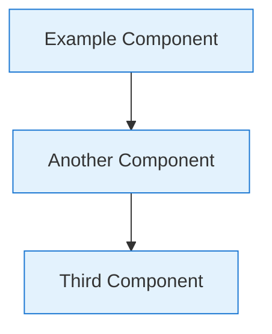

# Contributing to PAS Architecture Documentation

## Overview

This repository contains comprehensive architecture documentation for the Privileged Access Security (PAS) system. The documentation is designed for enterprise architects, security professionals, development teams, and operations staff working with healthcare-focused privileged access management solutions.

## Documentation Standards

### Writing Guidelines

#### Technical Writing Standards
- **Clarity**: Use clear, concise language appropriate for technical audiences
- **Consistency**: Maintain consistent terminology and formatting throughout
- **Accuracy**: Ensure all technical details are accurate and up-to-date
- **Completeness**: Provide sufficient detail for implementation and decision-making

#### Terminology Standards
- **PAS System**: Privileged Access Security system (not "PAS solution" or "PAS platform")
- **Components**: Use official component names (PAS Server, Audit Process, Gatekeeper, UCM Client)
- **Protocols**: Use standard protocol names (RSS Protocol, SSH, HTTPS, TLS)
- **Healthcare Terms**: Use proper healthcare terminology (PHI, HIPAA, covered entity, business associate)

### Document Structure

#### Required Sections
All major documents should include:
1. **Executive Summary**: High-level overview for architects and decision-makers
2. **Technical Details**: Detailed technical information for implementers
3. **Implementation Guidance**: Practical guidance for deployment and configuration
4. **Compliance Considerations**: HIPAA and regulatory compliance information
5. **Cross-References**: Links to related documents and specifications

#### Mermaid Diagrams
Use Mermaid diagrams for visual representations:
- **Architecture Diagrams**: System overviews and component relationships
- **Sequence Diagrams**: Process flows and interactions
- **Network Diagrams**: Network topology and security zones
- **Data Flow Diagrams**: Data movement and processing flows



### File Organization

#### Directory Structure
```
pas-architecture/
├── README.md                          # Repository overview
├── architecture/                      # Core architecture documentation
│   ├── system-overview.md             # High-level system architecture
│   ├── component-model.md             # Detailed component analysis
│   ├── data-flow.md                   # Data flow patterns
│   └── network-architecture.md        # Network topology (future)
├── specifications/                    # Technical specifications
│   ├── rss-protocol.md               # RSS protocol specification
│   ├── security-model.md             # Security architecture
│   ├── deployment-model.md           # Deployment procedures
│   └── audit-framework.md            # Audit specifications (future)
├── analysis/                         # Architecture analysis
│   ├── current-state.md              # Current state analysis
│   ├── recommendations.md            # Improvement recommendations
│   └── hipaa-compliance.md           # HIPAA compliance analysis
├── recommendations/                   # Detailed recommendations
│   ├── audit-separation.md           # Audit architecture improvements
│   ├── key-management.md             # Key management integration
│   ├── protocol-optimization.md      # RSS protocol improvements
│   ├── monitoring.md                 # HIPAA-compliant monitoring
│   └── configuration.md              # Configuration management
└── diagrams/                         # Visual documentation
    ├── sequences/                     # Sequence diagrams
    └── network/                       # Network diagrams
```

#### Naming Conventions
- **File Names**: Use kebab-case (lowercase with hyphens)
- **Document Titles**: Use Title Case for main headings
- **Section Headers**: Use sentence case for subsections
- **Code Examples**: Use appropriate syntax highlighting

## Content Guidelines

### Architecture Documentation

#### System Architecture
- Focus on component relationships and responsibilities
- Include both current state and proposed improvements
- Provide clear rationale for architectural decisions
- Consider scalability, security, and compliance requirements

#### Technical Specifications
- Include complete interface definitions
- Provide implementation examples where appropriate
- Document error conditions and handling
- Include performance characteristics and limitations

#### Security Documentation
- Address HIPAA compliance requirements explicitly
- Include threat modeling and risk assessment
- Document security controls and their implementation
- Provide configuration guidance for security hardening

### Code Examples

#### Configuration Examples
```yaml
# Example configuration with comments
pas:
  server:
    host: "pas.company.local"
    ports:
      https: 8443  # Web interface port
      rss: 7894    # RSS protocol port
```

#### Implementation Examples
```java
// Example Java code with proper documentation
public class ExampleService {
    /**
     * Example method demonstrating proper documentation
     * @param parameter Description of parameter
     * @return Description of return value
     */
    public String exampleMethod(String parameter) {
        // Implementation details
        return "result";
    }
}
```

### Compliance Documentation

#### HIPAA Considerations
- Always include HIPAA compliance analysis for new features
- Document data handling and privacy protection measures
- Include audit trail requirements and implementation
- Address business associate agreement implications

#### Regulatory Requirements
- Document compliance with relevant healthcare regulations
- Include data residency and sovereignty considerations
- Address international privacy regulations (GDPR, etc.)
- Provide compliance validation procedures

## Review Process

### Documentation Review

#### Technical Review
1. **Accuracy Review**: Verify technical accuracy against implementation
2. **Completeness Review**: Ensure all necessary information is included
3. **Consistency Review**: Check for consistent terminology and formatting
4. **Compliance Review**: Validate HIPAA and regulatory compliance information

#### Stakeholder Review
- **Architecture Team**: Overall architecture consistency and quality
- **Security Team**: Security model and compliance requirements
- **Development Team**: Implementation feasibility and technical accuracy
- **Operations Team**: Deployment and operational procedures

### Update Process

#### Regular Updates
- **Architecture Changes**: Update within 1 week of implementation
- **Protocol Changes**: Update immediately upon specification changes
- **Compliance Updates**: Update within 24 hours of regulatory changes
- **Operational Changes**: Update within 1 week of deployment changes

#### Version Control
- Use semantic versioning for major documentation releases
- Tag releases for stable documentation snapshots
- Maintain change logs for significant updates
- Archive deprecated documentation appropriately

## Quality Assurance

### Documentation Quality Metrics
- **Accuracy**: Technical information matches implementation
- **Completeness**: All necessary information is documented
- **Clarity**: Information is understandable by target audience
- **Currency**: Documentation reflects current system state

### Validation Procedures
- **Link Checking**: Verify all internal and external links
- **Diagram Validation**: Ensure diagrams render correctly
- **Code Example Testing**: Validate code examples compile/execute
- **Compliance Verification**: Confirm compliance statements are accurate

## Tools and Resources

### Documentation Tools
- **Markdown**: Primary documentation format
- **Mermaid**: Diagram generation and visualization
- **GitHub**: Version control and collaboration
- **VS Code**: Recommended editor with Markdown extensions

### Reference Materials
- **HIPAA Regulations**: Official HIPAA compliance requirements
- **Security Standards**: NIST, ISO 27001, and other security frameworks
- **Healthcare Standards**: HL7, FHIR, and healthcare interoperability standards
- **Technical Standards**: RFC specifications, protocol documentation

## Contact Information

### Documentation Team
- **Architecture Team**: Architecture review and validation
- **Security Team**: Security and compliance review
- **Development Team**: Technical accuracy and implementation guidance
- **Operations Team**: Deployment and operational procedures

### Support Channels
- **GitHub Issues**: Technical questions and documentation bugs
- **Architecture Reviews**: Formal architecture review process
- **Compliance Questions**: HIPAA and regulatory compliance support
- **Implementation Support**: Technical implementation assistance

---

*This contributing guide ensures consistent, high-quality documentation that serves the needs of all stakeholders while maintaining compliance with healthcare regulations and security requirements.*
