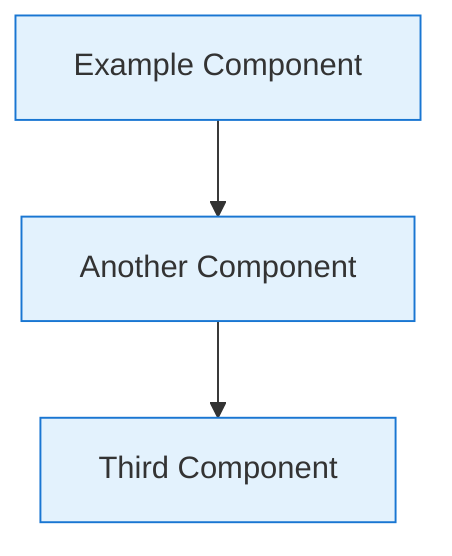

# Contributing to PAS Architecture Documentation

## Overview

This repository contains comprehensive architecture documentation for the Privileged Access Security (PAS) system. The documentation is designed for enterprise architects, security professionals, development teams, and operations staff working with multi-industry privileged access management solutions across healthcare, financial services, law enforcement, gaming, and government sectors.

## Documentation Standards

### Writing Guidelines

#### Technical Writing Standards
- **Clarity**: Use clear, concise language appropriate for technical audiences
- **Consistency**: Maintain consistent terminology and formatting throughout
- **Accuracy**: Ensure all technical details are accurate and up-to-date
- **Completeness**: Provide sufficient detail for implementation and decision-making
- **Current State Focus**: Document the current authoritative state without historical context

#### Clean Documentation Principles
- **No Historical References**: Documents should not reference previous versions or updates
- **Git Version Control**: All change history is maintained through git commits, not within documents
- **Present Tense**: Write in present tense describing current system state
- **No Update Tracking**: Avoid phrases like "updated from previous version" or "changed in v2.0"

#### Terminology Standards
- **PAS System**: Privileged Access Security system (not "PAS solution" or "PAS platform")
- **Components**: Use official component names (PAS Server, Audit Process, Gatekeeper, UCM Client)
- **Protocols**: Use standard protocol names (RSS Protocol, SSH, HTTPS, TLS)
- **Regulatory Terms**: Use proper regulatory terminology across industries (PHI, HIPAA, PCI DSS, SOX, GDPR, CJIS)

### Document Structure

#### Required Sections
All major documents should include:
1. **Executive Summary**: High-level overview for architects and decision-makers
2. **Technical Details**: Detailed technical information for implementers
3. **Implementation Guidance**: Practical guidance for deployment and configuration
4. **Compliance Considerations**: Multi-regulatory compliance information (HIPAA, PCI DSS, SOX, GDPR, CJIS, etc.)
5. **Cross-References**: Links to related documents and specifications

#### Mermaid Diagrams
Use Mermaid diagrams for visual representations:
- **Architecture Diagrams**: System overviews and component relationships
- **Sequence Diagrams**: Process flows and interactions
- **Network Diagrams**: Network topology and security zones
- **Data Flow Diagrams**: Data movement and processing flows



### File Organization

#### Directory Structure
```
docs/
├── README.md                          # Repository overview
├── CONTRIBUTING.md                    # Documentation guidelines
├── architecture/                      # Core architecture documentation
│   ├── system-overview.md             # High-level system architecture
│   ├── component-model.md             # Detailed component analysis
│   ├── audit-system.md               # Audit system architecture
│   ├── data-flow.md                   # Data flow patterns
│   ├── audit-race-condition.md       # Audit linking analysis
│   ├── pcap-analysis.md              # Network capture analysis
│   ├── ironrdp-integration.md        # IronRDP library analysis
│   └── documentation-guidelines.md   # Documentation standards
├── specifications/                    # Technical specifications
│   ├── rss-protocol.md               # RSS protocol specification
│   ├── security-model.md             # Security architecture
│   └── deployment-model.md           # Deployment procedures
└── recommendations/                   # Detailed recommendations
    ├── audit-separation.md           # Audit architecture proposals
    ├── integrated-audit-web-strategy.md # Comprehensive modernization proposal
    ├── key-management.md             # Key management integration
    ├── protocol-optimization.md      # RSS protocol improvements
    ├── monitoring.md                 # HIPAA-compliant monitoring
    └── configuration.md              # Configuration management
```

#### Naming Conventions
- **File Names**: Use kebab-case (lowercase with hyphens)
- **Document Titles**: Use Title Case for main headings
- **Section Headers**: Use sentence case for subsections
- **Code Examples**: Use appropriate syntax highlighting

## Content Guidelines

### Architecture Documentation

#### Current State Documentation
- Document the current system architecture as implemented
- Focus on component relationships and responsibilities
- Provide clear rationale for architectural decisions
- Consider scalability, security, and compliance requirements

#### Proposed Changes
- Place all proposed changes in the `recommendations/` directory
- Clearly label documents as proposals or recommendations
- Do not mix current state with proposed future state in architecture documents
- Use present tense for current state, future tense for proposals

#### Technical Specifications
- Include complete interface definitions
- Provide implementation examples where appropriate
- Document error conditions and handling
- Include performance characteristics and limitations

#### Security Documentation
- Address multi-regulatory compliance requirements explicitly (HIPAA, PCI DSS, SOX, GDPR, CJIS)
- Include threat modeling and risk assessment across industry sectors
- Document security controls and their implementation for various regulatory frameworks
- Provide configuration guidance for security hardening across different compliance requirements

### Code Examples

#### Configuration Examples
```yaml
# Example configuration with comments
pas:
  server:
    host: "pas.company.local"
    ports:
      https: 8443  # Web interface port
      rss: 7894    # RSS protocol port
```

#### Implementation Examples
```java
// Example Java code with proper documentation
public class ExampleService {
    /**
     * Example method demonstrating proper documentation
     * @param parameter Description of parameter
     * @return Description of return value
     */
    public String exampleMethod(String parameter) {
        // Implementation details
        return "result";
    }
}
```

### Compliance Documentation

#### Multi-Industry Regulatory Considerations
- **Healthcare**: HIPAA (US), GDPR (EU), NHS standards (UK) compliance analysis
- **Financial**: PCI DSS, SOX, Basel III, MiFID II requirements
- **Law Enforcement**: CJIS and national security standards
- **Gaming**: State gaming commission regulations and AML requirements
- **Government**: Municipal, state, federal, and international compliance frameworks

#### Data Protection and Privacy
- Document data handling and privacy protection measures across all sectors
- Include audit trail requirements and implementation for various regulations
- Address business associate agreements (healthcare) and similar contractual requirements
- Consider data residency and sovereignty requirements for international deployments

#### Compliance Validation
- Provide compliance validation procedures for each regulatory framework
- Include automated compliance reporting capabilities
- Document audit and assessment procedures for different industry requirements

## Review Process

### Documentation Review

#### Technical Review
1. **Accuracy Review**: Verify technical accuracy against implementation
2. **Completeness Review**: Ensure all necessary information is included
3. **Consistency Review**: Check for consistent terminology and formatting
4. **Compliance Review**: Validate HIPAA and regulatory compliance information

#### Stakeholder Review
- **Architecture Team**: Overall architecture consistency and quality
- **Security Team**: Security model and compliance requirements
- **Development Team**: Implementation feasibility and technical accuracy
- **Operations Team**: Deployment and operational procedures

### Update Process

#### Regular Updates
- **Architecture Changes**: Update within 1 week of implementation
- **Protocol Changes**: Update immediately upon specification changes
- **Compliance Updates**: Update within 24 hours of regulatory changes
- **Operational Changes**: Update within 1 week of deployment changes

#### Version Control Philosophy
- **Git as single source of truth**: All change history maintained through git commits
- **Clean documentation**: Documents contain current state only, no historical references
- **Commit messages**: Use clear, descriptive commit messages for documentation changes
- **No internal versioning**: Avoid version numbers or update tracking within documents

## Clean Documentation Principles

### Git Version Control Integration
- **No historical context in documents**: Git commits provide complete change history
- **Present tense only**: Describe current system state, not evolution
- **Remove discovery language**: Rewrite exploratory content as authoritative statements
- **No update references**: Avoid phrases like "updated from", "changed in", or "new in version"

### Document Revision Guidelines
When updating documentation:
1. **Remove discovery language** from existing content
2. **Rewrite as current state** without historical context
3. **Preserve technical accuracy** while improving clarity
4. **Let git track changes** - don't document the documentation process

### Examples of Clean Documentation

#### ❌ Avoid Historical References
```markdown
# Updated Analysis of Audit System (v2.1)
This document has been updated to reflect new findings about the audit race condition.
Previously, we thought the issue was timing-related, but further investigation revealed...
```

#### ✅ Clean Current State
```markdown
# Audit System Analysis
The audit linking system suffers from a fundamental race condition between
audit connection creation and database access record creation...
```

## Quality Assurance

### Documentation Quality Metrics
- **Accuracy**: Technical information matches implementation
- **Completeness**: All necessary information is documented
- **Clarity**: Information is understandable by target audience
- **Currency**: Documentation reflects current system state
- **Cleanliness**: No historical references or update tracking within documents

### Validation Procedures
- **Link Checking**: Verify all internal and external links
- **Diagram Validation**: Ensure diagrams render correctly
- **Code Example Testing**: Validate code examples compile/execute
- **Compliance Verification**: Confirm compliance statements are accurate

## Tools and Resources

### Documentation Tools
- **Markdown**: Primary documentation format
- **Mermaid**: Diagram generation and visualization
- **GitHub**: Version control and collaboration
- **VS Code**: Recommended editor with Markdown extensions

### Reference Materials
- **Healthcare Regulations**: HIPAA (US), GDPR (EU), NHS standards (UK)
- **Financial Regulations**: PCI DSS, SOX, Basel III, MiFID II
- **Law Enforcement Standards**: CJIS, federal security requirements
- **Gaming Regulations**: State gaming commission requirements, AML standards
- **Security Frameworks**: NIST, ISO 27001, and other security standards
- **Technical Standards**: RFC specifications, protocol documentation
- **International Standards**: Data sovereignty, cross-border transfer regulations

## Contact Information

### Documentation Team
- **Architecture Team**: Architecture review and validation
- **Security Team**: Security and compliance review
- **Development Team**: Technical accuracy and implementation guidance
- **Operations Team**: Deployment and operational procedures

### Support Channels
- **GitHub Issues**: Technical questions and documentation bugs
- **Architecture Reviews**: Formal architecture review process
- **Compliance Questions**: HIPAA and regulatory compliance support
- **Implementation Support**: Technical implementation assistance

---

*This contributing guide ensures consistent, high-quality documentation that serves the needs of all stakeholders while maintaining compliance with healthcare regulations and security requirements.*
