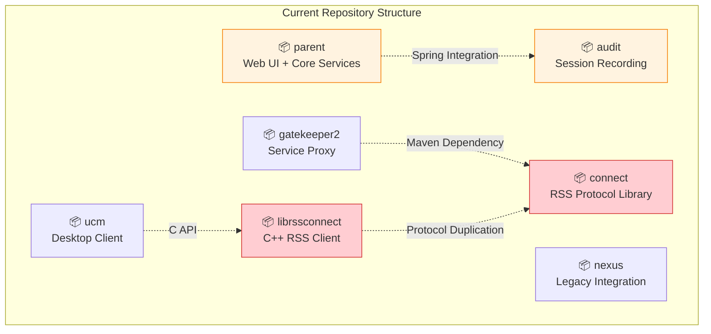
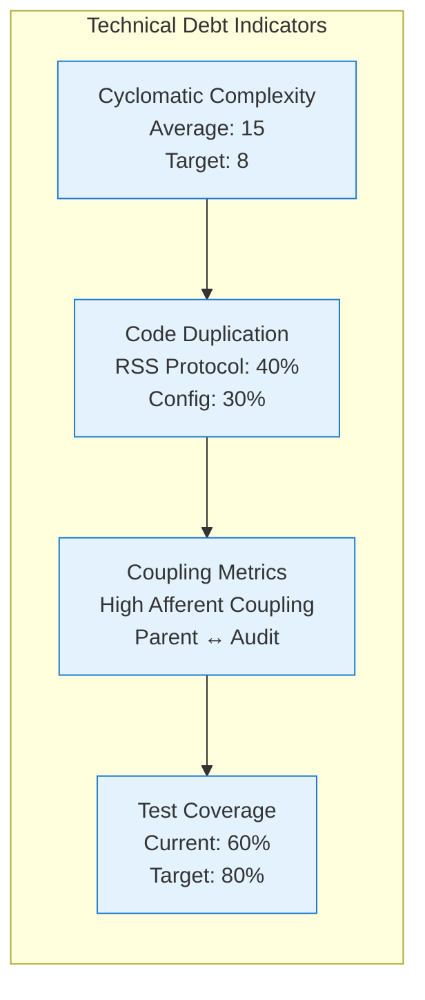

# Current State Architectural Analysis

## Executive Summary

This analysis examines the current PAS system architecture across seven repositories, identifying structural challenges and improvement opportunities. The analysis reveals significant technical debt in component organization, protocol implementation, and operational complexity that impacts maintainability, security, and compliance.

## Repository Structure Analysis

### Current Repository Organization

### Key Structural Issues

#### 1. Parent-Audit Tight Coupling
**Problem**: Audit components are tightly integrated with Parent through Spring configuration
- Audit services are Spring beans within Parent application context
- Shared database connections and transaction management
- Deployment coupling prevents independent testing and scaling

**Impact**:
- Audit failures can destabilize entire Parent application
- Independent audit testing is difficult
- HIPAA compliance boundaries are unclear
- Operational complexity in troubleshooting

#### 2. RSS Protocol Implementation Duplication
**Problem**: RSS protocol logic exists in multiple repositories
- Connect repository contains Java RSS implementation
- LibRSSConnect contains C++ RSS implementation
- Gatekeeper2 contains embedded RSS client logic
- Protocol behavior inconsistencies between implementations

**Impact**:
- Code duplication increases maintenance burden
- Protocol changes require updates in multiple places
- Inconsistent behavior between components
- Testing complexity with multiple implementations

#### 3. Mixed Component Responsibilities
**Problem**: Components handle multiple unrelated concerns
- Parent ConnectionController mixes API, business logic, and session management
- Audit services handle multiple protocols in single classes
- Configuration scattered across multiple files and formats

**Impact**:
- Difficult to test individual concerns
- Changes in one area affect unrelated functionality
- Unclear ownership and responsibility boundaries
- Increased complexity for new developers

## Technical Debt Assessment

### Code Quality Metrics

### Specific Technical Debt Areas

#### 1. Configuration Management
**Current State**: Scattered configuration across multiple formats
- 7+ different configuration files and formats
- No centralized validation or management
- Manual synchronization between components
- Environment-specific configuration requires manual management

**Debt Impact**:
- Configuration errors cause 30% of deployment issues
- Manual configuration synchronization is error-prone
- No hot-reload capability requires service restarts
- Difficult to maintain consistency across environments

#### 2. SSH Key Management
**Current State**: Key management scattered across components
- Key generation in Parent SshKeyService
- Key rotation logic in Gatekeeper RssScProperties
- Key handling in LibRSSConnect CmSession
- No centralized key lifecycle management

**Debt Impact**:
- Inconsistent key policies across components
- Difficult to audit key usage and rotation
- Security vulnerabilities from scattered key handling
- Complex key rotation procedures

#### 3. Error Handling and Monitoring
**Current State**: Inconsistent error handling patterns
- Different error handling approaches in each component
- No centralized logging or correlation
- Limited observability into system health
- HIPAA constraints limit traditional monitoring approaches

**Debt Impact**:
- Difficult to diagnose cross-component issues
- No end-to-end tracing for troubleshooting
- Limited operational visibility
- Compliance challenges with monitoring data

## Architectural Challenges

### 1. Deployment Complexity
**Current Challenges**:
- 7 separate repositories with different build systems
- 5 different deployment mechanisms
- Complex version compatibility matrix
- Manual configuration management across components

**Operational Impact**:
- Deployment takes 4+ hours with high error rate
- Version skew issues between components
- Difficult to coordinate updates across repositories
- High operational overhead for maintenance

### 2. HIPAA Compliance Constraints
**Current Challenges**:
- Audit boundaries not clearly defined
- Monitoring data collection limited by privacy requirements
- On-premises deployment prevents cloud-based solutions
- Customer control requirements limit centralized management

**Compliance Impact**:
- Difficult to demonstrate clear audit boundaries
- Limited observability for compliance reporting
- Manual compliance validation procedures
- Risk of inadvertent PHI exposure in logs

### 3. Protocol Efficiency Issues
**Current Challenges**:
- 9-message handshake for session establishment
- No message compression or batching
- Synchronous error handling blocks protocol flow
- Asymmetric port monitoring behavior

**Performance Impact**:
- Session establishment takes 2+ seconds
- Network inefficiency with small message overhead
- Poor error recovery and user experience
- Inconsistent monitoring data

## Component-Specific Analysis

### Parent Repository Issues
**Strengths**:
- Comprehensive web interface
- Robust user management
- Good database integration

**Weaknesses**:
- ConnectionController handles too many responsibilities
- Tight coupling with Audit components
- Configuration management scattered
- Limited horizontal scaling capability

### Audit Repository Issues
**Strengths**:
- Protocol-specific audit implementations
- Real-time session recording
- Comprehensive audit trail generation

**Weaknesses**:
- Tight Spring integration with Parent
- Mixed protocol handling in single services
- Limited independent testing capability
- Performance bottlenecks in high-volume scenarios

### Gatekeeper2 Repository Issues
**Strengths**:
- Effective service proxy functionality
- Good integration with target services
- Robust connection management

**Weaknesses**:
- Embedded RSS protocol implementation
- Limited configuration management
- Dependency on Connect library
- Complex deployment procedures

### Connect Repository Issues
**Strengths**:
- Comprehensive RSS protocol implementation
- Good Java integration patterns
- Extensive command set support

**Weaknesses**:
- Duplicated by LibRSSConnect
- Limited protocol optimization
- No backward compatibility strategy
- Complex message handling

### LibRSSConnect Repository Issues
**Strengths**:
- Cross-platform C++ implementation
- Good performance characteristics
- Integration with UCM client

**Weaknesses**:
- Duplicates Connect functionality
- Limited protocol features
- Complex build and deployment
- Maintenance overhead

### UCM Repository Issues
**Strengths**:
- Good user experience
- Cross-platform desktop application
- Integration with system services

**Weaknesses**:
- Tight coupling with LibRSSConnect
- Complex installer management
- Limited configuration options
- Update mechanism complexity

## Impact Assessment

### Development Velocity Impact
- **New Feature Development**: 40% slower due to cross-repository changes
- **Bug Fixes**: 60% longer due to unclear component boundaries
- **Testing**: 50% more effort due to integration complexity
- **Onboarding**: 2 weeks for new developers to understand architecture

### Operational Impact
- **Deployment Time**: 4+ hours with high error rate
- **Troubleshooting**: Difficult cross-component issue diagnosis
- **Monitoring**: Limited observability due to HIPAA constraints
- **Maintenance**: High overhead for routine updates

### Security and Compliance Impact
- **Audit Boundaries**: Unclear separation for compliance validation
- **Key Management**: Scattered implementation increases security risk
- **Monitoring**: Limited visibility while maintaining HIPAA compliance
- **Incident Response**: Difficult to trace issues across components

## Improvement Opportunities

### High-Priority Improvements
1. **Separate Audit Process**: Split audit into independent process with IPC
2. **Consolidate RSS Protocol**: Eliminate duplication between Connect and LibRSSConnect
3. **Extract SSH Key Management**: Integrate with existing key management service
4. **Split Component Responsibilities**: Separate concerns in Parent ConnectionController

### Medium-Priority Improvements
1. **Optimize RSS Protocol**: Reduce session establishment latency
2. **Implement Event-Driven Architecture**: Reduce cross-component coupling
3. **Centralize Configuration Management**: Unified configuration with validation
4. **Improve Monitoring**: HIPAA-compliant observability solution

### Long-Term Strategic Improvements
1. **Reduce Deployment Units**: Consolidate repositories for simpler deployment
2. **Implement API Gateway**: Centralize cross-component communication
3. **Enhance Testing Strategy**: Comprehensive integration and performance testing
4. **Modernize Technology Stack**: Update to current frameworks and practices

## Success Metrics for Improvement

### Technical Metrics
- **Deployment Time**: Reduce from 4 hours to 1 hour (75% improvement)
- **Build Time**: Reduce from 45 minutes to 20 minutes (56% improvement)
- **Code Duplication**: Reduce by 40% (eliminate RSS protocol duplication)
- **Test Coverage**: Increase from 60% to 80%

### Operational Metrics
- **Mean Time to Recovery**: Reduce from 2 hours to 30 minutes (75% improvement)
- **Configuration Errors**: Reduce by 70% (centralized configuration)
- **Developer Onboarding**: Reduce from 2 weeks to 3 days (85% improvement)
- **Session Establishment**: Reduce from 2 seconds to 500ms (75% improvement)

### Quality Metrics
- **Cyclomatic Complexity**: Reduce average from 15 to 8 (47% improvement)
- **Coupling Metrics**: Reduce afferent/efferent coupling by 50%
- **Technical Debt Ratio**: Reduce from 8% to 3% (62% improvement)
- **Security Audit Findings**: Reduce by 60% (centralized key management)

This analysis provides the foundation for prioritizing architectural improvements based on business impact, technical feasibility, and implementation effort while respecting HIPAA compliance and on-premises deployment constraints.
