# HIPAA Compliance Analysis and Requirements

## Executive Summary

This document analyzes HIPAA compliance requirements for the PAS system and provides guidance for maintaining compliance while implementing architectural improvements. The analysis covers data protection, audit requirements, access controls, and operational considerations specific to healthcare environments.

## HIPAA Overview and Applicability

### HIPAA Scope for PAS System
The PAS system operates in healthcare environments where it may have access to or process Protected Health Information (PHI). While PAS primarily manages privileged access rather than directly handling patient data, HIPAA compliance is critical because:

- **Indirect PHI Access**: PAS provides access to systems that contain PHI
- **Audit Requirements**: All access to PHI-containing systems must be logged and auditable
- **Business Associate Agreements**: PAS vendor may be considered a business associate
- **Administrative Safeguards**: PAS implements administrative controls for PHI access

### Relevant HIPAA Rules
- **Privacy Rule**: Protects PHI and establishes patient rights
- **Security Rule**: Establishes technical and administrative safeguards
- **Breach Notification Rule**: Requires notification of PHI breaches
- **Enforcement Rule**: Establishes penalties and enforcement procedures

## Data Classification and Protection

### PHI Identification in PAS Context

#### What Constitutes PHI in PAS

```mermaid
graph TB
    subgraph "PHI in PAS System"
        A[❌ Direct PHI<br/>Patient records, medical data]
        B[⚠️ Indirect PHI Identifiers<br/>User IDs accessing patient systems]
        C[⚠️ Access Patterns<br/>Who accessed what when]
        D[⚠️ Session Content<br/>Screen recordings, keystrokes]
        E[✅ System Metadata<br/>Performance metrics, error counts]
    end
    
    classDef prohibited fill:#FFCDD2,stroke:#D32F2F
    classDef restricted fill:#FFF3E0,stroke:#F57C00
    classDef allowed fill:#C8E6C9,stroke:#388E3C
    
    class A prohibited
    class B,C,D restricted
    class E allowed
```


#### Data Handling Requirements

**Prohibited Data Collection**:
- Patient names, addresses, phone numbers
- Medical record numbers or patient IDs
- Social security numbers
- Direct medical information

**Restricted Data (Requires Special Handling)**:
- User identifiers when accessing patient systems
- Session recordings that may contain PHI
- Audit logs with detailed access patterns
- IP addresses that could identify individuals

**Permitted Data Collection**:
- Aggregate system performance metrics
- Error counts and system health data
- Anonymized usage statistics
- Technical configuration data

### Data Protection Requirements

#### Encryption Standards
```yaml
# HIPAA-Compliant Encryption Requirements
encryption:
  data_at_rest:
    algorithm: "AES-256"
    key_management: "Customer-controlled HSM or key management service"
    database: "Transparent Data Encryption (TDE)"
    audit_logs: "AES-256 with customer keys"
  
  data_in_transit:
    protocol: "TLS 1.2 or higher"
    ssh_tunnels: "SSH-2 with strong ciphers"
    internal_communication: "mTLS for all internal APIs"
    
  key_management:
    rotation_frequency: "Annual minimum, quarterly recommended"
    key_storage: "Hardware Security Module (HSM) preferred"
    access_controls: "Role-based access to encryption keys"
```

#### Access Controls
- **Role-Based Access Control (RBAC)**: Minimum necessary access principle
- **Multi-Factor Authentication**: Required for all administrative access
- **Session Timeouts**: Automatic logout after inactivity
- **Audit Trail**: Complete logging of all access attempts

## Audit and Logging Requirements

### HIPAA Audit Requirements

#### Required Audit Elements

```mermaid
graph TB
    subgraph "HIPAA Audit Requirements"
        A[👤 User Identification<br/>Who accessed the system]
        B[📅 Date and Time<br/>When access occurred]
        C[🎯 Resource Accessed<br/>What system/data was accessed]
        D[🔧 Action Performed<br/>What action was taken]
        E[📍 Source Location<br/>Where access originated]
        F[✅ Success/Failure<br/>Whether access was granted]
    end
    
    classDef required fill:#E3F2FD,stroke:#1976D2
    class A,B,C,D,E,F required
```


#### PAS Audit Implementation
```yaml
# HIPAA-Compliant Audit Configuration
audit:
  required_fields:
    - user_id: "Authenticated user identifier"
    - timestamp: "ISO 8601 timestamp with timezone"
    - resource: "Target system or service accessed"
    - action: "Specific action performed (connect, disconnect, view)"
    - source_ip: "Source IP address (if not PHI)"
    - session_id: "Unique session identifier"
    - result: "Success, failure, or error code"
    
  retention:
    minimum_period: "6 years"
    recommended_period: "7 years"
    storage_location: "Customer-controlled environment"
    
  protection:
    encryption: "AES-256 encryption at rest"
    integrity: "Digital signatures or HMAC"
    access_controls: "Restricted to authorized personnel only"
```

### Audit Log Management

#### Log Storage and Retention
- **Retention Period**: Minimum 6 years, recommended 7 years
- **Storage Location**: Customer-controlled environment only
- **Backup Requirements**: Regular backups with same protection as primary logs
- **Disposal**: Secure deletion when retention period expires

#### Log Access Controls
- **Authorized Personnel Only**: Limit access to compliance and security teams
- **Audit Trail for Auditors**: Log all access to audit logs themselves
- **Read-Only Access**: Prevent modification of historical audit data
- **Export Capabilities**: Support for compliance reporting and investigations

## Technical Safeguards Implementation

### Access Control Technical Safeguards

#### Unique User Identification
```yaml
# User Identification Requirements
user_identification:
  unique_identifiers: "Each user must have unique identifier"
  authentication_methods:
    - multi_factor: "Required for administrative access"
    - certificate_based: "Preferred for system-to-system authentication"
    - integration: "LDAP/Active Directory integration"
  
  session_management:
    timeout: "15 minutes inactivity timeout"
    concurrent_sessions: "Limited concurrent sessions per user"
    session_tracking: "Complete session lifecycle logging"
```

#### Automatic Logoff
- **Inactivity Timeout**: 15 minutes maximum for PHI access
- **Session Termination**: Automatic cleanup of all session resources
- **Warning Notifications**: User warning before automatic logoff
- **Grace Period**: Brief grace period for user response

#### Encryption and Decryption
- **Data at Rest**: AES-256 encryption for all stored data
- **Data in Transit**: TLS 1.2+ for all network communications
- **Key Management**: Customer-controlled encryption keys
- **Algorithm Standards**: FIPS 140-2 validated cryptographic modules

### Audit Controls Technical Safeguards

#### Audit Log Generation
```yaml
# Audit Controls Configuration
audit_controls:
  automatic_generation: "All access attempts logged automatically"
  tamper_protection: "Cryptographic integrity protection"
  real_time_monitoring: "Real-time audit event processing"
  
  log_format:
    standard: "Structured logging (JSON or similar)"
    fields: "All required HIPAA audit elements"
    timestamps: "Synchronized time sources (NTP)"
    
  monitoring:
    failed_access: "Alert on repeated failed access attempts"
    unusual_patterns: "Detect unusual access patterns"
    system_events: "Log all system administrative events"
```

## Administrative Safeguards

### Security Officer Requirements
- **Designated Security Officer**: Assigned responsibility for HIPAA compliance
- **Security Policies**: Written policies and procedures for PHI protection
- **Training Programs**: Regular HIPAA training for all personnel
- **Incident Response**: Procedures for handling security incidents

### Workforce Training and Access Management
- **Access Authorization**: Formal process for granting system access
- **Access Review**: Regular review of user access permissions
- **Termination Procedures**: Immediate access revocation upon termination
- **Training Documentation**: Records of HIPAA training completion

## Physical Safeguards

### Facility Access Controls
- **Data Center Security**: Physical security for servers and infrastructure
- **Workstation Security**: Controls for accessing PHI from workstations
- **Media Controls**: Secure handling of backup media and storage devices
- **Equipment Disposal**: Secure disposal of equipment containing PHI

### Workstation and Media Controls
- **Workstation Access**: Controls limiting access to PHI-containing workstations
- **Media Reuse**: Secure erasure before media reuse
- **Backup Security**: Physical security for backup media
- **Transportation**: Secure transportation of media containing PHI

## Compliance Monitoring and Reporting

### Ongoing Compliance Activities

#### Regular Assessments
```yaml
# Compliance Monitoring Schedule
compliance_monitoring:
  risk_assessments:
    frequency: "Annual comprehensive assessment"
    scope: "All systems handling or accessing PHI"
    documentation: "Written risk assessment reports"
    
  security_reviews:
    frequency: "Quarterly security control reviews"
    scope: "Technical and administrative safeguards"
    remediation: "Documented remediation plans"
    
  audit_reviews:
    frequency: "Monthly audit log reviews"
    scope: "Access patterns and security events"
    reporting: "Summary reports to security officer"
```

#### Incident Response
- **Incident Detection**: Automated detection of potential security incidents
- **Response Procedures**: Documented procedures for incident response
- **Breach Assessment**: Process for determining if incident constitutes breach
- **Notification Requirements**: Procedures for required breach notifications

### Compliance Reporting

#### Internal Reporting
- **Monthly Security Reports**: Summary of security events and metrics
- **Quarterly Compliance Reviews**: Comprehensive compliance status reports
- **Annual Risk Assessments**: Formal risk assessment documentation
- **Incident Reports**: Documentation of all security incidents

#### External Reporting
- **Breach Notifications**: Required notifications to HHS and affected individuals
- **Audit Support**: Support for external compliance audits
- **Regulatory Inquiries**: Response to regulatory inquiries and investigations
- **Business Associate Reporting**: Reporting to covered entities as required

## Architectural Compliance Considerations

### System Design for HIPAA Compliance

#### Data Minimization
- **Collect Only Necessary Data**: Limit data collection to minimum required
- **Anonymization**: Remove or anonymize identifiers where possible
- **Aggregation**: Use aggregate data instead of individual records
- **Retention Limits**: Implement automatic data purging after retention period

#### Separation of Concerns
- **Audit Isolation**: Separate audit process for compliance boundary clarity
- **Access Segregation**: Separate systems for different types of access
- **Network Segmentation**: Isolate PHI-containing systems from general network
- **Role Separation**: Separate administrative and operational roles

### Technology Choices for Compliance

#### Preferred Technologies
- **Open Source**: Auditable code for security validation
- **Standard Protocols**: Well-established security protocols (TLS, SSH)
- **Mature Frameworks**: Proven security frameworks and libraries
- **Customer Control**: Technologies that maintain customer control over data

#### Compliance-Friendly Features
- **Audit Logging**: Built-in comprehensive audit logging
- **Encryption**: Native encryption capabilities
- **Access Controls**: Granular access control mechanisms
- **Monitoring**: Built-in security monitoring and alerting

This HIPAA compliance analysis provides the framework for maintaining compliance while implementing architectural improvements, ensuring that all changes enhance rather than compromise the system's compliance posture.
