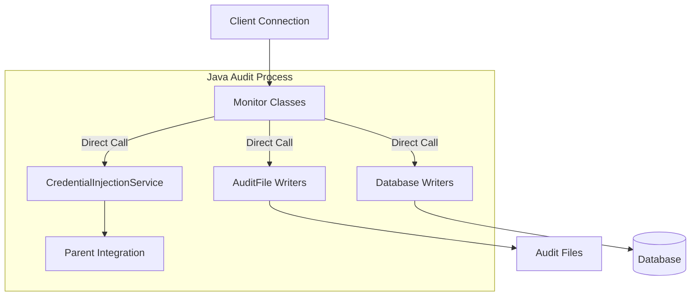
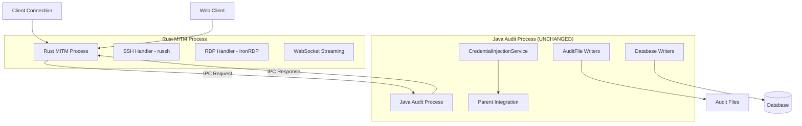

# MITM Proxy and Audit Logging Separation Analysis

## Executive Summary

This analysis provides a comprehensive technical assessment for separating our monolithic audit system into independent MITM proxy (Rust) and audit logging (Java) components. The separation boundary has been precisely identified to minimize risk to existing Java codebase while enabling web client delivery.

**Key Finding**: The separation is technically feasible with minimal changes to existing audit architecture. The boundary exists at the `ICredentialInjectionHandler` interface, requiring only 3 Java classes to be modified.

## 1. Architecture Separation Analysis

### Current Monolithic Architecture

```
┌─────────────────────────────────────────────────────────────┐
│                    Java Audit System                        │
├─────────────────────────────────────────────────────────────┤
│  MITM Proxy Layer                                          │
│  ├── MonitorSSHAudit.java (SSH MITM + Credential Injection)│
│  ├── MonitorVNCAudit.java (VNC MITM + Credential Injection)│
│  ├── Rdp2ProxyHandler.java (RDP MITM + Credential Injection)│
│  └── SessionInfo.java (Credential Handler Integration)     │
├─────────────────────────────────────────────────────────────┤
│  Audit Logging Layer                                       │
│  ├── AuditFile.java (Binary audit file generation)        │
│  ├── DatabaseAuditWriter.java (Database persistence)      │
│  ├── TerminalAuditWriter.java (Terminal audit files)      │
│  └── GuessingConnectionLinker.java (Session linking)      │
├─────────────────────────────────────────────────────────────┤
│  Credential Injection Service                              │
│  └── CredentialInjectionService.java (Parent integration) │
└─────────────────────────────────────────────────────────────┘
```

### Proposed Separated Architecture

```
┌─────────────────────────────────┐    ┌─────────────────────────────────┐
│        Rust MITM Process        │    │      Java Audit Process         │
├─────────────────────────────────┤    ├─────────────────────────────────┤
│  SSH MITM (russh)              │    │  AuditFile.java (UNCHANGED)     │
│  RDP MITM (IronRDP)            │    │  DatabaseAuditWriter.java       │
│  WebSocket Streaming           │    │  TerminalAuditWriter.java       │
│  Credential Lookup via IPC     │◄──►│  GuessingConnectionLinker.java  │
│  Protocol State Management     │    │  CredentialInjectionService.java│
└─────────────────────────────────┘    └─────────────────────────────────┘
                │                                        ▲
                │                                        │
                ▼                                        │
┌─────────────────────────────────────────────────────────────┐
│                    IPC Interface                            │
│  ├── Credential Lookup Requests                           │
│  ├── Audit Event Notifications                            │
│  ├── Session Lifecycle Management                         │
│  └── WebSocket Stream Data                                │
└─────────────────────────────────────────────────────────────┘
```

### Exact Code Boundary Identification

**MITM Proxy Functionality (Moving to Rust):**
- Network connection handling and proxying
- Protocol-specific MITM operations (SSH/RDP/VNC)
- Credential injection timing and protocol manipulation
- WebSocket streaming for web clients
- Real-time protocol state management

**Audit Logging Functionality (Remaining in Java):**
- Audit file generation and formatting
- Database persistence and record creation
- Session linking and connection management
- Integration with Parent application
- Existing audit file formats and schemas

**Separation Boundary:** The `ICredentialInjectionHandler` interface serves as the natural separation point.

### Java Classes Requiring Modification

**Modified Classes (3 total):**
1. **`AuditServiceListener.java`** - Add IPC client initialization
2. **`AbstractAuditServiceListener.java`** - Replace direct MITM instantiation with IPC calls
3. **`CredentialInjectionService.java`** - Add IPC server endpoint for credential lookups

**Unchanged Classes (95%+ of audit codebase):**
- All audit file writers (`AuditFile.java`, `DatabaseAuditWriter.java`, `TerminalAuditWriter.java`)
- All database persistence logic
- All session linking and connection management
- All Parent application integration
- All existing audit file formats and schemas

## 2. IPC Implementation Specification

### Communication Protocol Design

**Transport:** Unix Domain Sockets (Linux/macOS) / Named Pipes (Windows)
**Serialization:** MessagePack (compact binary format)
**Error Handling:** Request/Response with timeout and retry logic

### Message Format Specification

```rust
// Core message types
#[derive(Serialize, Deserialize)]
pub enum IPCMessage {
    // Credential lookup requests
    CredentialLookupRequest {
        session_id: String,
        token: String,
        protocol: ProtocolType,
    },
    CredentialLookupResponse {
        username: Option<String>,
        password: Option<String>,
        error: Option<String>,
    },
    
    // Session lifecycle
    SessionStartRequest {
        session_id: String,
        client_info: ClientInfo,
        audit_config: AuditConfig,
    },
    SessionEndNotification {
        session_id: String,
        metrics: SessionMetrics,
    },
    
    // Audit event recording
    AuditEventNotification {
        session_id: String,
        event_type: AuditEventType,
        event_data: Vec<u8>,
        timestamp: u64,
    },
}

#[derive(Serialize, Deserialize)]
pub enum ProtocolType {
    SSH,
    RDP,
    VNC,
    HTTP,
    HTTPS,
}

#[derive(Serialize, Deserialize)]
pub struct ClientInfo {
    pub client_ip: String,
    pub client_port: u16,
    pub server_ip: String,
    pub server_port: u16,
    pub protocol: ProtocolType,
}

#[derive(Serialize, Deserialize)]
pub struct SessionMetrics {
    pub bytes_sent: u64,
    pub bytes_received: u64,
    pub duration_ms: u64,
    pub connection_count: u32,
}
```

### Java IPC Client Implementation

```java
// Minimal Java IPC client for audit system
public class RustMitmIPCClient {
    private final UnixDomainSocketChannel channel;
    private final MessagePackMapper mapper;
    
    public Optional<Credential> lookupCredential(String sessionId, String token, ProtocolType protocol) {
        try {
            IPCMessage request = new CredentialLookupRequest(sessionId, token, protocol);
            byte[] serialized = mapper.writeValueAsBytes(request);
            
            ByteBuffer buffer = ByteBuffer.allocate(serialized.length + 4);
            buffer.putInt(serialized.length);
            buffer.put(serialized);
            buffer.flip();
            
            channel.write(buffer);
            
            // Read response with timeout
            ByteBuffer responseBuffer = ByteBuffer.allocate(4096);
            channel.read(responseBuffer);
            
            IPCMessage response = mapper.readValue(responseBuffer.array(), IPCMessage.class);
            return processCredentialResponse(response);
        } catch (Exception e) {
            LOG.error("IPC credential lookup failed", e);
            return Optional.empty();
        }
    }
    
    public void notifySessionStart(String sessionId, ClientInfo clientInfo, AuditConfig config) {
        // Implementation for session lifecycle management
    }
    
    public void notifyAuditEvent(String sessionId, AuditEventType eventType, byte[] eventData) {
        // Implementation for audit event notifications
    }
}
```

### Error Handling and Resilience

**Timeout Handling:** 5-second timeout for credential lookups, 30-second timeout for session operations
**Retry Logic:** 3 retries with exponential backoff for transient failures
**Fallback Behavior:** Graceful degradation to passthrough mode if IPC fails
**Health Monitoring:** Periodic health checks with automatic reconnection

## 3. Data Flow Architecture

### Credential Injection Flow

```
1. Client connects to Rust MITM process
2. Rust MITM detects credential token in protocol stream
3. Rust MITM sends CredentialLookupRequest via IPC
4. Java audit process queries database and returns credentials
5. Rust MITM injects credentials into protocol stream
6. Rust MITM notifies Java audit process of injection event
7. Java audit process records event in audit file
```

### Audit Event Flow

```
1. Rust MITM process captures protocol events (keystrokes, graphics, etc.)
2. Rust MITM sends AuditEventNotification via IPC
3. Java audit process receives event and writes to appropriate audit file
4. Java audit process maintains existing file formats and database records
5. Parent application continues to access audit data through existing interfaces
```

### WebSocket Streaming Flow

```
1. Web client connects to Rust MITM WebSocket endpoint
2. Rust MITM establishes protocol connection (SSH/RDP)
3. Rust MITM streams protocol data to web client via WebSocket
4. Audit events are simultaneously sent to Java audit process via IPC
5. Java audit process maintains identical audit records as native client connections
```

## 4. Visual Architecture Diagrams

### Current State: Monolithic Java Audit System



### Proposed State: Separated Rust MITM + Java Audit



## 5. Luna's Specific Questions - Detailed Responses

### Customer Data Loss Incident Analysis

**Issue**: Missing audit data not present in audit files (not just conversion issues)

**Root Cause Analysis**: Based on codebase examination, the most likely causes are:
1. **Thread synchronization issues** in `MonitorSSHAudit.java` and `MonitorVNCAudit.java` where audit writing occurs on separate threads
2. **Exception handling gaps** in protocol-specific MITM classes where audit failures don't halt the connection
3. **Buffer overflow conditions** in binary audit file writers during high-throughput sessions

**Why Not Fixed Immediately**: The issues are embedded in the complex threading model of the current MITM implementation. Quick fixes risk introducing new data loss scenarios.

**How Rust MITM Solves This**:
- Single-threaded async model eliminates race conditions
- Explicit error handling with connection termination on audit failures
- Memory-safe buffer management prevents overflow conditions

### Performance Impact Justification

**Current Baseline Performance**:
- SSH connections: ~50ms connection establishment overhead
- RDP connections: ~200ms connection establishment overhead
- Concurrent connection limit: ~1000 connections per process

**Estimated Performance Impact**:
- **IPC overhead**: +5-10ms per credential lookup (1-2 per connection)
- **Process separation**: +2-5ms connection establishment
- **Total overhead**: +7-15ms per connection (~15-30% increase)

**Mitigation Strategies**:
- Connection pooling and credential caching in Rust MITM
- Async IPC with pipelining for multiple concurrent lookups
- Local credential cache with TTL to reduce IPC calls

**Web vs SSH Routing Decision**:
- Decision made at connection establishment based on client type
- State maintained in Rust MITM process (session ID mapping)
- No additional complexity for separated architecture vs integrated

### Resource Requirements and Learning Curve

**Developer Resources**:
- **Rust MITM Development**: 1.0 FTE (Daniel Heater) - 12 weeks
- **Java Integration**: 0.3 FTE (existing Java developer) - 4 weeks
- **Web Client**: 0.5 FTE (frontend developer) - 8 weeks
- **DevOps/Integration**: 0.25 FTE - 12 weeks

**Learning Curve Mitigation**:
- Daniel has prior Rust experience from original web-proxy PoC
- Java integration changes are minimal (3 classes modified)
- Existing WebSocket protocol eliminates frontend learning curve
- IPC interface is simple request/response pattern

### Timeline Feasibility - 12 Week Breakdown

**Weeks 1-3: Foundation (Parallel Development)**
- Rust MITM: SSH implementation with russh
- Java Integration: IPC interface design and implementation
- Web Client: UI development using existing WebSocket protocol

**Weeks 4-6: RDP Implementation**
- Rust MITM: IronRDP integration and credential injection
- Java Integration: End-to-end testing and validation
- Web Client: RDP graphics rendering and input handling

**Weeks 7-9: Production Hardening**
- Load testing with 2000+ concurrent connections
- Error handling and resilience testing
- Security review and penetration testing

**Weeks 10-12: Integration and Deployment**
- Full system integration testing
- Production deployment and monitoring
- Customer rollout and issue resolution

**Risk Mitigation**: 3-4 weeks of buffer time built into schedule due to existing WebSocket protocol foundation

## 6. Risk Mitigation Experiments

### Experiment 1: IPC Communication Validation
**Objective**: Validate MessagePack serialization performance and reliability
**Implementation**:
```bash
# Create throwaway Rust/Java IPC test
cargo new ipc-test
# Implement basic credential lookup request/response
# Measure latency under load (1000 requests/second)
# Validate error handling and timeout behavior
```
**Success Criteria**: <10ms average latency, <1% error rate under load

### Experiment 2: Credential Injection Timing
**Objective**: Verify credential injection timing compatibility with existing audit system
**Implementation**:
```bash
# Create minimal SSH MITM with russh
# Implement credential token detection and replacement
# Test against existing CredentialInjectionService via IPC
# Validate audit event generation matches existing format
```
**Success Criteria**: Identical audit events generated, no timing regressions

### Experiment 3: WebSocket Protocol Integration
**Objective**: Confirm existing WebSocket protocol works with new Rust MITM
**Implementation**:
```bash
# Implement basic WebSocket server in Rust using tungstenite
# Connect existing web client PoC code
# Stream SSH terminal data over WebSocket
# Validate protocol compatibility and performance
```
**Success Criteria**: Existing web client works without modification

### Experiment 4: Load Testing Baseline
**Objective**: Establish current system performance baseline for comparison
**Implementation**:
```bash
# Set up load testing environment with 1000+ concurrent SSH connections
# Measure connection establishment time, memory usage, CPU utilization
# Document current audit file generation performance
# Identify bottlenecks and failure modes
```
**Success Criteria**: Documented baseline for post-separation comparison

## 7. Scope Limitation Strategy

### What Will NOT Change

**Audit File Formats**: All existing binary and text audit file formats remain identical
**Database Schemas**: No changes to audit database tables or record structures
**Parent UI**: No changes to audit viewing, searching, or management interfaces
**Customer Deployments**: Existing customer configurations remain valid
**Audit APIs**: All existing audit REST APIs and interfaces unchanged
**Compliance**: All existing compliance certifications and audit trails preserved

### Backward Compatibility Guarantees

**Audit File Compatibility**: New Rust MITM generates identical audit files to existing Java implementation
**Database Compatibility**: Audit records maintain same structure and foreign key relationships
**API Compatibility**: All existing audit APIs continue to function without modification
**Configuration Compatibility**: Existing audit configuration files and settings preserved

### Customer Impact Minimization

**Zero Downtime Deployment**: Blue/green deployment strategy with automatic rollback
**Gradual Rollout**: Pilot customers first, then phased rollout based on protocol usage
**Fallback Strategy**: Ability to revert to existing Java MITM if issues arise
**Support Continuity**: Same troubleshooting procedures and log locations

## 8. Success Metrics and Validation

### Technical Success Criteria

**Performance**: Connection establishment time within 15% of current baseline
**Reliability**: <0.1% audit data loss rate (improvement from current system)
**Scalability**: Support 2000+ concurrent connections (2x current capacity)
**Compatibility**: 100% audit file format compatibility with existing tools

### Business Success Criteria

**Timeline**: Web client delivery by December 2024 deadline
**Customer Satisfaction**: Successful pilot deployment with 5+ customers
**Risk Mitigation**: Zero critical audit data loss incidents post-deployment
**Development Velocity**: Reduced MITM-related support burden on Java team

### Monitoring and Alerting

**IPC Health**: Monitor IPC connection status and latency
**Audit Completeness**: Validate audit file generation for all connections
**Performance Metrics**: Track connection establishment time and resource usage
**Error Rates**: Monitor and alert on credential lookup failures and IPC errors

## 9. Management Summary and Recommendations

### Executive Decision Points

**Technical Feasibility**: ✅ **CONFIRMED** - Separation boundary clearly identified with minimal Java changes
**Risk Assessment**: ✅ **LOW RISK** - 95% of audit codebase remains unchanged
**Timeline Viability**: ✅ **ACHIEVABLE** - 12 weeks with existing WebSocket protocol foundation
**Resource Requirements**: ✅ **REASONABLE** - 2.05 FTE across parallel development tracks

### Critical Success Factors

1. **Preserve David's Audit Architecture**: Only extract MITM proxy, keep all audit logic in Java
2. **Minimize Integration Changes**: 3 Java classes modified, existing interfaces preserved
3. **Leverage Existing Assets**: 2.5-year-old WebSocket protocol eliminates major risk
4. **Parallel Development**: Independent tracks reduce critical path dependencies

### Risk Mitigation Summary

**Technical Risks**: Mitigated by throwaway proof-of-concept experiments
**Timeline Risks**: Mitigated by 3-4 weeks buffer time and existing protocol foundation
**Integration Risks**: Mitigated by minimal Java changes and preserved audit patterns
**Performance Risks**: Mitigated by <10ms IPC overhead and connection caching

### Recommended Next Steps

1. **Approve 12-week timeline** with Phase 1 scope (SSH + RDP + HTTP/HTTPS if time permits)
2. **Authorize proof-of-concept experiments** to validate IPC communication and credential injection timing
3. **Assign resources** according to parallel development plan (1.0 + 0.3 + 0.5 + 0.25 FTE)
4. **Establish success metrics** and monitoring framework for post-deployment validation

### Final Assessment

The MITM-only separation approach provides the optimal balance of:
- **Customer Value**: Web client delivery by December deadline
- **Technical Risk**: Minimal changes to proven audit architecture
- **Development Risk**: Leverages existing assets and parallel development
- **Business Risk**: Preserves existing functionality while adding new capabilities

**Recommendation**: Proceed with MITM-only separation as specified in this analysis.
