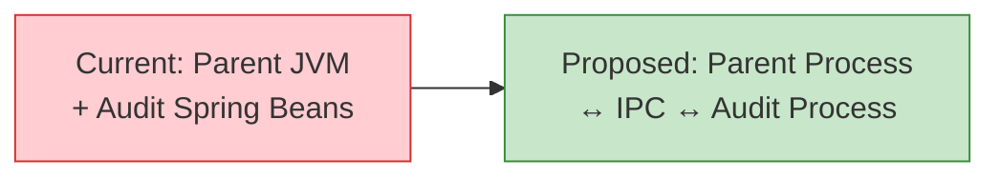
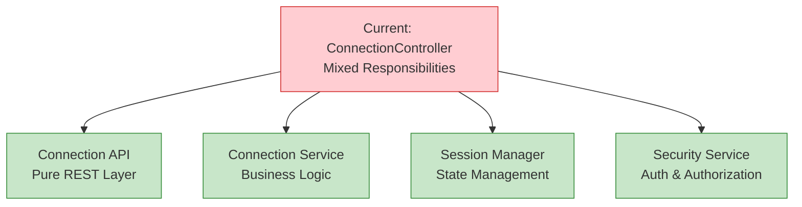
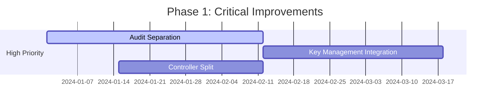
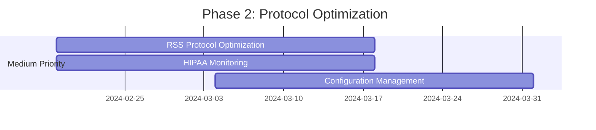
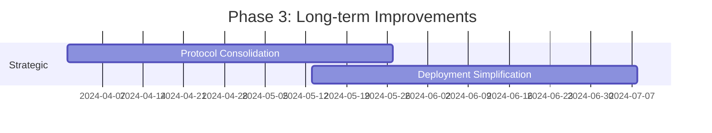

# Architectural Improvement Recommendations

## Executive Summary

This document presents prioritized architectural improvements for the PAS system based on comprehensive analysis of current state challenges. Recommendations are organized by priority and impact, with specific consideration for HIPAA compliance constraints and on-premises deployment requirements.

## Recommendation Prioritization Framework

### Priority Criteria
- **Business Impact**: Effect on user experience, compliance, and operational efficiency
- **Technical Risk**: Implementation complexity and potential for disruption
- **HIPAA Compliance**: Alignment with healthcare privacy and security requirements
- **Resource Requirements**: Development effort and timeline considerations

### Implementation Approach
- **Phased Implementation**: Gradual changes to minimize risk and disruption
- **Backward Compatibility**: Maintain existing functionality during transitions
- **Customer Control**: Respect on-premises deployment and customer autonomy
- **Compliance First**: Ensure all changes enhance rather than compromise compliance

## High-Priority Recommendations

### 1. Separate Audit into Independent Process
**Priority**: HIGH | **Effort**: 6-8 weeks | **Risk**: Medium

#### Problem Statement
Current audit architecture is tightly coupled to Parent through Spring integration, creating deployment coupling, operational complexity, and unclear HIPAA compliance boundaries.

#### Recommended Solution
Split audit into a separate process with clean IPC mechanisms for communication with Parent.

#### Key Benefits
- **Fault Isolation**: Audit process crashes don't affect Parent
- **HIPAA Compliance**: Cleaner audit boundaries for compliance validation
- **Independent Testing**: Audit can be tested independently with mock IPC
- **Operational Excellence**: Separate monitoring and troubleshooting

#### Implementation Strategy
1. **Phase 1**: Implement Unix domain socket IPC infrastructure
2. **Phase 2**: Extract SSH audit service from Parent
3. **Phase 3**: Migrate HTTP and RDP audit services
4. **Phase 4**: Comprehensive testing and production deployment

### 2. Integrate with Existing Key Management Service
**Priority**: HIGH | **Effort**: 5-6 weeks | **Risk**: Medium

#### Problem Statement
SSH key management is scattered across multiple components with inconsistent policies and no centralized audit trail.

#### Recommended Solution
Integrate PAS components with existing key management service for centralized policy and storage while keeping usage logic in PAS components.

#### Responsibility Distribution
**Move to Key Management Service**:
- Key generation policy enforcement
- Key storage and lifecycle management
- Key distribution coordination
- Centralized audit trail

**Keep in PAS Components**:
- Key usage and local caching
- Protocol-specific key handling
- Connection-specific key derivation

#### Key Benefits
- **Centralized Security**: Consistent key policies across all components
- **Audit Compliance**: Complete key lifecycle audit for HIPAA compliance
- **Operational Simplicity**: Unified key management procedures
- **Security Enhancement**: Reduced attack surface through centralization

### 3. Split Parent ConnectionController Responsibilities
**Priority**: HIGH | **Effort**: 4-5 weeks | **Risk**: Low

#### Problem Statement
ConnectionController handles multiple unrelated concerns (authentication, session management, API routing) making testing and maintenance difficult.

#### Recommended Solution
Separate ConnectionController into focused services with single responsibilities.

#### Key Benefits
- **Single Responsibility**: Each service has clear, focused purpose
- **Independent Testing**: Test each concern separately
- **Better Security**: Isolated authentication and authorization logic
- **Simplified Maintenance**: Easier debugging and modification

## Medium-Priority Recommendations

### 4. Optimize RSS Protocol with Backward Compatibility
**Priority**: MEDIUM | **Effort**: 4-5 weeks | **Risk**: Medium

#### Problem Statement
Current RSS protocol has inefficiencies including 9-message handshake, no compression, and asymmetric port monitoring.

#### Recommended Solution
Implement protocol optimizations as optional extensions with full backward compatibility.

#### Specific Optimizations
- **Batched Session Establishment**: Reduce from 9 to 3 messages
- **Message Compression**: GZIP compression for large messages
- **Async Error Handling**: Correlation IDs for distributed tracing
- **Symmetric Port Monitoring**: Fix APORTOPEN/APORTCLOSE asymmetry

#### Backward Compatibility Strategy
- Capability negotiation during INIT message
- Feature flags for gradual rollout
- Automatic fallback to v109 behavior
- Comprehensive compatibility testing

### 5. Implement HIPAA-Compliant Monitoring
**Priority**: MEDIUM | **Effort**: 4-5 weeks | **Risk**: Low

#### Problem Statement
Limited observability into system health while maintaining HIPAA compliance and on-premises deployment constraints.

#### Recommended Solution
Local monitoring stack with anonymized aggregate telemetry.

#### Architecture Components
- **Local Prometheus**: Metrics collection on customer premises
- **Local Grafana**: Visualization with pre-built dashboards
- **Local AlertManager**: Customer-controlled alerting
- **Anonymized Telemetry**: Optional aggregate data for vendor

#### HIPAA Compliance Features
- No PHI/PII in metrics collection
- All detailed data stays on customer premises
- Customer control over telemetry sharing
- Comprehensive audit trail for monitoring access

### 6. Centralize Configuration Management
**Priority**: MEDIUM | **Effort**: 4-5 weeks | **Risk**: Low

#### Problem Statement
Configuration scattered across multiple files and formats with no validation or hot reload capability.

#### Recommended Solution
Hierarchical file-based configuration with validation, hot reload, and customer override capabilities.

#### Key Features
- **Hierarchical Structure**: Base configuration with customer overrides
- **Validation**: Schema-based validation with cross-component checks
- **Hot Reload**: Configuration changes without service restarts
- **RPM Integration**: Seamless configuration handling during upgrades

## Long-Term Strategic Recommendations

### 7. Consolidate RSS Protocol Implementation
**Priority**: LOW | **Effort**: 8-10 weeks | **Risk**: High

#### Problem Statement
RSS protocol logic duplicated between Connect (Java) and LibRSSConnect (C++) repositories.

#### Recommended Solution
Consolidate into single authoritative implementation with language-specific bindings.

#### Implementation Options
1. **Java-Primary**: Connect as authoritative, C++ bindings via JNI
2. **C++-Primary**: LibRSSConnect as authoritative, Java bindings via JNI
3. **Protocol Service**: Separate service with REST/gRPC APIs

### 8. Reduce Deployment Units
**Priority**: LOW | **Effort**: 8-10 weeks | **Risk**: Medium

#### Problem Statement
Seven separate repositories with different deployment mechanisms create operational complexity.

#### Recommended Solution
Consolidate into four deployment units:
- **PAS-Server**: Parent + Audit consolidated
- **Gatekeeper-Service**: Gatekeeper + Connect dependency
- **UCM-Client**: UCM + LibRSSConnect unified
- **Nexus**: Unchanged (vendor-specific)

## Implementation Roadmap

### Phase 1: Critical Coupling Resolution (Weeks 1-8)

### Phase 2: Protocol and Monitoring (Weeks 9-16)

### Phase 3: Strategic Consolidation (Weeks 17-32)

## Success Metrics and Expected Outcomes

### Technical Improvements
- **75% reduction** in deployment time (4 hours → 1 hour)
- **56% reduction** in build time (45 minutes → 20 minutes)
- **75% improvement** in session establishment latency (2 seconds → 500ms)
- **40% reduction** in code duplication

### Operational Benefits
- **75% reduction** in Mean Time to Recovery (2 hours → 30 minutes)
- **70% reduction** in configuration errors
- **85% improvement** in developer onboarding (2 weeks → 3 days)
- **60% reduction** in cross-component issues

### Quality Enhancements
- **47% reduction** in cyclomatic complexity (15 → 8 average)
- **50% reduction** in coupling metrics
- **62% reduction** in technical debt ratio (8% → 3%)
- **60% reduction** in security audit findings

## Risk Mitigation Strategies

### Technical Risks
- **Parallel Systems**: Run old and new systems in parallel during transitions
- **Feature Flags**: Enable gradual rollout with instant rollback capability
- **Comprehensive Testing**: Extensive compatibility and performance testing
- **Monitoring**: Enhanced monitoring during transition periods

### Operational Risks
- **Rollback Plans**: Maintain ability to revert changes if issues arise
- **Training**: Ensure team understands new architecture patterns
- **Documentation**: Comprehensive documentation and runbooks
- **Customer Communication**: Regular updates on progress and changes

### Compliance Risks
- **HIPAA Validation**: Ensure all changes enhance compliance posture
- **Audit Trail**: Maintain complete audit trail during transitions
- **Customer Control**: Preserve customer autonomy and control
- **Privacy Protection**: Ensure no PHI exposure during changes

## Conclusion

These recommendations provide a clear path for transforming the PAS system from its current state of technical debt to a modern, maintainable, and scalable architecture. The phased approach minimizes risk while delivering significant improvements in maintainability, operational simplicity, and compliance posture.

The focus on HIPAA compliance and on-premises deployment constraints ensures that improvements align with customer requirements and regulatory obligations while providing the foundation for future growth and enhancement.
