```mermaid
graph TB
    subgraph "PAS Server Internal Architecture"
        WebUI[🌐 Web Interface<br/>Angular/React Frontend]
        RestAPI[🔌 REST API<br/>Spring Boot Controllers]
        AuthService[🔐 Authentication Service<br/>LDAP/SAML Integration]
        SessionMgr[📋 Session Manager<br/>Session Lifecycle]
        ConfigMgr[⚙️ Configuration Manager<br/>System Configuration]
        AuditCoord[📊 Audit Coordinator<br/>IPC with Audit Process]
    end
    
    WebUI --> RestAPI
    RestAPI --> AuthService
    RestAPI --> SessionMgr
    RestAPI --> ConfigMgr
    SessionMgr --> AuditCoord
```

```mermaid
graph TB
    subgraph "Audit Process Architecture"
        AuditCoord[📊 Audit Coordinator<br/>Session Management]
        SSHAudit[🔒 SSH Audit Service<br/>SSH Traffic Analysis]
        HTTPAudit[🌐 HTTP Audit Service<br/>HTTP/HTTPS Proxy]
        RDPAudit[🖥️ RDP Audit Service<br/>RDP Session Recording]
        VNCAudit[👁️ VNC Audit Service<br/>VNC Session Recording]
        Storage[💾 Audit Storage<br/>Encrypted Log Storage]
    end
    
    AuditCoord --> SSHAudit
    AuditCoord --> HTTPAudit
    AuditCoord --> RDPAudit
    AuditCoord --> VNCAudit
    SSHAudit --> Storage
    HTTPAudit --> Storage
    RDPAudit --> Storage
    VNCAudit --> Storage
```

```mermaid
graph TB
    subgraph "Gatekeeper Architecture"
        GKCore[🚪 Gatekeeper Core<br/>Main Service Logic]
        SSHProxy[🔒 SSH Proxy<br/>SSH Connection Proxy]
        RDPProxy[🖥️ RDP Proxy<br/>RDP Connection Proxy]
        HTTPProxy[🌐 HTTP Proxy<br/>HTTP/HTTPS Proxy]
        PolicyEngine[📋 Policy Engine<br/>Access Control]
        HealthMonitor[💓 Health Monitor<br/>Service Monitoring]
    end
    
    GKCore --> SSHProxy
    GKCore --> RDPProxy
    GKCore --> HTTPProxy
    GKCore --> PolicyEngine
    GKCore --> HealthMonitor
```

```mermaid
graph TB
    subgraph "UCM Client Architecture"
        UCMUI[🖥️ UCM UI<br/>Qt Desktop Interface]
        SessionMgr[📋 Session Manager<br/>Local Session Tracking]
        AppLauncher[🚀 Application Launcher<br/>Client App Management]
        PortMgr[🔌 Port Manager<br/>Local Port Forwarding]
        UpdateMgr[🔄 Update Manager<br/>Auto-Update System]
        LibRSSInt[📚 LibRSS Integration<br/>Protocol Communication]
    end
    
    UCMUI --> SessionMgr
    UCMUI --> AppLauncher
    SessionMgr --> PortMgr
    SessionMgr --> LibRSSInt
    AppLauncher --> PortMgr
    UpdateMgr --> UCMUI
```

```mermaid
graph TB
    subgraph "LibRSSConnect Architecture"
        RSSClient[📡 RSS Client<br/>Protocol Implementation]
        SSHTunnel[🔒 SSH Tunnel Manager<br/>SSH Connection Management]
        SessionState[📋 Session State<br/>State Management]
        ErrorHandler[⚠️ Error Handler<br/>Error Recovery]
        PlatformAPI[🔧 Platform API<br/>OS-Specific Functions]
    end
    
    RSSClient --> SSHTunnel
    RSSClient --> SessionState
    RSSClient --> ErrorHandler
    SSHTunnel --> PlatformAPI
    ErrorHandler --> SessionState
```

# PAS Component Model

## Executive Summary

This document provides a detailed analysis of PAS system components, their responsibilities, interfaces, and relationships. The component model serves as the foundation for understanding system architecture and planning improvements.

## Component Overview

```mermaid
graph TB
    subgraph "Client Tier"
        UCM[🖥️ UCM Client<br/>Desktop Application]
        LibRSS[📚 LibRSSConnect<br/>C++ Protocol Library]
    end
    
    subgraph "Management Tier"
        Parent[🏠 PAS Server<br/>Web UI + Management]
        Audit[📊 Audit Process<br/>Session Recording]
        DB[(🗄️ Database<br/>Configuration + Logs)]
    end
    
    subgraph "Service Tier"
        GK[🚪 Gatekeeper<br/>Service Proxy]
        Services[⚙️ Target Services<br/>SSH, RDP, HTTP, etc.]
    end
    
    UCM --> LibRSS
    LibRSS -.->|RSS/SSH| Parent
    LibRSS -.->|SSH Tunnels| Audit
    Parent --> DB
    Parent -.->|IPC| Audit
    GK -.->|RSS/SSH| Parent
    Audit -.->|Proxy Control| GK
    GK --> Services
    
    classDef client fill:#E3F2FD,stroke:#1976D2
    classDef management fill:#FFF3E0,stroke:#F57C00
    classDef service fill:#E8F5E8,stroke:#388E3C
    
    class UCM,LibRSS client
    class Parent,Audit,DB management
    class GK,Services service
```

## Component Detailed Analysis

### 1. PAS Server (Parent)

#### Purpose and Scope
Central management server providing web interface, user management, and system coordination.

#### Core Responsibilities
- **Web Interface**: HTTPS-based user interface for access requests and administration
- **User Authentication**: Integration with customer identity systems (LDAP, AD, SAML)
- **Session Management**: Coordinate privileged access sessions across components
- **Configuration Management**: Centralized configuration for all system components
- **API Gateway**: REST APIs for programmatic access and integration

#### Technical Architecture

#### Key Interfaces
- **HTTPS Web Interface**: Port 8443 for user access and administration
- **RSS Protocol Server**: Port 7894 for component communication (inbound only)
- **SSH Server**: Port 22 for inbound SSH connections (NEVER initiates outbound SSH)
- **Database Connection**: PostgreSQL/MySQL for persistent storage
- **IPC Interface**: Unix domain sockets for audit process communication

#### **Critical Security Constraint**
**SSH Connection Policy**: The PAS Server operates under a strict security policy:
- ✅ **Receives SSH connections** from UCM clients and Gatekeeper
- ❌ **NEVER initiates SSH connections** to any other component
- ✅ **Uses non-SSH protocols** (HTTPS, RSS) for outbound communication

This constraint ensures security isolation and prevents the PAS Server from being used as a network pivot point.

#### Technology Stack
- **Framework**: Java Spring Boot 2.7+
- **Web Server**: Embedded Tomcat
- **Database**: PostgreSQL 12+ or MySQL 8+
- **Security**: Spring Security with SAML/LDAP integration
- **Monitoring**: Micrometer with Prometheus metrics

#### Current Issues and Improvements
**Issues**:
- ConnectionController handles too many responsibilities
- Tight coupling with audit components
- Limited horizontal scaling capability

**Planned Improvements**:
- Split ConnectionController into focused services
- Implement IPC communication with audit process
- Add support for horizontal scaling with load balancing

### 2. Audit Process

#### Purpose and Scope
Real-time session recording and analysis for compliance and security monitoring.

#### Core Responsibilities
- **Protocol Interception**: Capture and analyze SSH, RDP, HTTP, VNC traffic
- **Session Recording**: Real-time recording with encryption and compression
- **Credential Injection**: Seamless authentication for audited sessions
- **Compliance Reporting**: Generate audit reports for regulatory compliance
- **Threat Detection**: Real-time analysis for suspicious activity

#### Technical Architecture

#### Key Interfaces
- **IPC Interface**: Unix domain sockets for Parent communication
- **SSH Tunnels**: Encrypted tunnels for client connections
- **Proxy Interfaces**: Protocol-specific proxy endpoints
- **Storage Interface**: Encrypted audit log storage

#### Technology Stack
- **Framework**: Java with protocol-specific libraries
- **SSH Library**: JSch or Apache MINA SSHD
- **HTTP Proxy**: Netty or Apache HttpComponents
- **RDP Library**: Custom RDP protocol implementation
- **Encryption**: AES-256 for audit log encryption

#### Current Issues and Improvements
**Issues**:
- Tight Spring integration with Parent
- Mixed protocol handling in single services
- Limited independent testing capability

**Planned Improvements**:
- Separate process with IPC communication
- Protocol-specific audit services
- Independent testing and deployment

### 3. Gatekeeper

#### Purpose and Scope
Service proxy and access enforcement point within customer internal network.

#### Core Responsibilities
- **Service Proxy**: Proxy connections to target services (SSH, RDP, HTTP)
- **Access Enforcement**: Enforce time-based and policy-based access controls
- **Session Coordination**: Coordinate with audit process for session recording
- **Application Integration**: Manage application-specific configurations
- **Health Monitoring**: Monitor target service availability and health

#### Technical Architecture

#### Key Interfaces
- **RSS Protocol Client**: Connection to PAS Server for coordination
- **Service Proxies**: Protocol-specific proxy interfaces
- **Target Services**: Connections to actual services (SSH, RDP, HTTP)
- **Configuration Interface**: Local configuration management

#### Technology Stack
- **Framework**: Java Spring Boot
- **Proxy Libraries**: Protocol-specific proxy implementations
- **RSS Client**: Connect library for RSS protocol communication
- **Configuration**: YAML-based configuration with hot reload

#### Current Issues and Improvements
**Issues**:
- Embedded RSS protocol implementation
- Limited configuration management
- Complex deployment procedures

**Planned Improvements**:
- Use Connect library for RSS protocol
- Centralized configuration management
- Simplified deployment with RPM packages

### 4. UCM (Universal Connection Manager)

#### Purpose and Scope
Desktop client application providing user interface for secure access to privileged systems.

#### Core Responsibilities
- **User Interface**: Desktop application for access requests and session management
- **Application Launching**: Launch and manage client applications (RDP, SSH clients)
- **Local Port Forwarding**: Manage local port forwards for application connections
- **Session Management**: Track and manage active privileged sessions
- **Update Management**: Automatic updates and configuration synchronization

#### Technical Architecture

#### Key Interfaces
- **LibRSSConnect API**: C API for RSS protocol communication
- **System Integration**: OS-specific APIs for application launching
- **File System**: Local staging and temporary file management
- **Network**: Local port binding and forwarding

#### Technology Stack
- **Framework**: Qt 5.15+ for cross-platform desktop development
- **Language**: C++ with Qt framework
- **Platform Support**: Windows, macOS, Linux
- **Integration**: LibRSSConnect for protocol communication

#### Current Issues and Improvements
**Issues**:
- Tight coupling with LibRSSConnect
- Complex installer management
- Limited configuration options

**Planned Improvements**:
- Unified build with LibRSSConnect
- Simplified installer with auto-update
- Enhanced configuration management

### 5. LibRSSConnect

#### Purpose and Scope
C++ library providing RSS protocol client implementation for UCM and other native applications.

#### Core Responsibilities
- **RSS Protocol Client**: Complete RSS protocol implementation in C++
- **SSH Tunnel Management**: Establish and manage SSH tunnels
- **Session State Management**: Track session state and handle reconnections
- **Error Handling**: Robust error handling and recovery mechanisms
- **Cross-Platform Support**: Support for Windows, macOS, and Linux

#### Technical Architecture

#### Key Interfaces
- **C API**: C interface for integration with UCM and other applications
- **SSH Library**: Integration with SSH client libraries
- **Network API**: Cross-platform networking interfaces
- **Platform APIs**: OS-specific system integration

#### Technology Stack
- **Language**: C++ with C API interface
- **SSH Library**: libssh2 or similar cross-platform SSH library
- **Build System**: CMake for cross-platform builds
- **Platform Support**: Windows (MSVC), macOS (Clang), Linux (GCC)

#### Current Issues and Improvements
**Issues**:
- Duplicates Connect functionality
- Limited protocol features compared to Java implementation
- Complex build and deployment

**Planned Improvements**:
- Consolidate with Connect library
- Enhanced protocol feature support
- Simplified build and deployment process

## Component Interaction Patterns

### Session Establishment Flow

### Configuration Management Flow

## Component Dependencies

### Current Dependency Graph

### Proposed Dependency Improvements

## Component Scaling Considerations

### Horizontal Scaling Patterns
- **PAS Server**: Load balancer with session affinity
- **Audit Process**: Multiple instances with session partitioning
- **Gatekeeper**: Multiple instances with service-based routing
- **Database**: Read replicas and connection pooling

### Performance Characteristics
- **PAS Server**: 1,000+ concurrent web sessions
- **Audit Process**: 500+ concurrent audit sessions per instance
- **Gatekeeper**: 100+ concurrent proxy sessions per instance
- **UCM Client**: Single-user desktop application

This component model provides the foundation for understanding system architecture and planning improvements while maintaining clear separation of concerns and well-defined interfaces between components.
