# PAS Component Model

## Executive Summary

This document provides a detailed analysis of PAS system components, their responsibilities, interfaces, and relationships. The component model serves as the foundation for understanding system architecture and planning improvements.

## Component Overview

```mermaid
graph TB
    subgraph "Client Tier"
        UCM[🖥️ UCM Client<br/>Desktop Application]
        LibRSS[📚 LibRSSConnect<br/>C++ Protocol Library]
    end
    
    subgraph "Management Tier"
        Parent[🏠 PAS Server<br/>Web UI + Management]
        Audit[📊 Audit Process<br/>Session Recording]
        DB[(🗄️ Database<br/>Configuration + Logs)]
    end
    
    subgraph "Service Tier"
        GK[🚪 Gatekeeper<br/>Service Proxy]
        Services[⚙️ Target Services<br/>SSH, RDP, HTTP, etc.]
    end
    
    UCM --> LibRSS
    LibRSS -.->|RSS/SSH| Parent
    LibRSS -.->|SSH Tunnels| Audit
    Parent --> DB
    Parent -.->|IPC| Audit
    GK -.->|RSS/SSH| Parent
    Audit -.->|Proxy Control| GK
    GK --> Services
    
    classDef client fill:#E3F2FD,stroke:#1976D2
    classDef management fill:#FFF3E0,stroke:#F57C00
    classDef service fill:#E8F5E8,stroke:#388E3C
    
    class UCM,LibRSS client
    class Parent,Audit,DB management
    class GK,Services service
```

## Component Detailed Analysis

### 1. PAS Server (Parent)

Central management server providing web interface, user management, and system coordination.

**Core Responsibilities**:
- Web-based user interface for access requests and administration
- User authentication and integration with customer identity systems
- Session management and coordination across system components
- Centralized configuration management for all PAS components
- REST APIs for programmatic access and third-party integration

**Technology Stack**: Java Spring Boot, PostgreSQL/MySQL, Angular/React frontend

**Detailed Documentation**: See [PAS Server (Parent) Architecture](parent-server.md)

### 2. Audit Process

Real-time session recording and analysis for compliance and security monitoring.

**Core Responsibilities**:
- Protocol interception and analysis for SSH, RDP, HTTP, VNC traffic
- Real-time session recording with encryption and compression
- Credential injection for seamless authentication
- Multi-regulatory compliance reporting and audit trail generation
- Real-time threat detection and suspicious activity analysis

**Technology Stack**: Java with protocol-specific libraries, custom RDP implementation

**Detailed Documentation**: See [Audit System Architecture](audit-system.md)

### 3. Gatekeeper

Service proxy and access enforcement point within customer internal network.

**Core Responsibilities**:
- Proxy connections to target services (SSH, RDP, HTTP, databases)
- Enforce time-based and policy-based access controls
- Coordinate with audit process for session recording
- Manage application-specific configurations and policies
- Monitor target service availability and health

**Technology Stack**: Go (Gatekeeper 2.0) / Java (Legacy), YAML configuration

**Detailed Documentation**: See [Gatekeeper Architecture](gatekeeper.md)

### 4. UCM (Universal Connection Manager)

Desktop client application providing user interface for secure access to privileged systems.

**Core Responsibilities**:
- Desktop application for access requests and session management
- Launch and manage client applications (RDP, SSH clients)
- Local port forwarding and connection management
- Track and manage active privileged sessions
- Automatic updates and configuration synchronization

**Technology Stack**: C++ with Qt framework, cross-platform support

**Detailed Documentation**: See [UCM Client Architecture](ucm-client.md)

### 5. LibRSSConnect

C++ library providing RSS protocol client implementation for UCM and other native applications.

**Core Responsibilities**:
- RSS protocol client implementation in C++
- Multi-session SSH management and coordination
- Cross-platform support for Windows, macOS, and Linux
- C API interface for integration with client applications
- Complex port forwarding and session lifecycle management

**Technology Stack**: C++ with C API, libssh2, CMake build system

**Detailed Documentation**: See [LibRSSConnect Architecture](librssconnect.md)

### 6. Connect

Java-based protocol implementation providing comprehensive RSS protocol support and client connectivity.

**Core Responsibilities**:
- Complete and authoritative RSS protocol implementation
- Java applet and desktop client applications
- Advanced protocol features and extensions
- Integration libraries for third-party applications
- Reference implementation for protocol enhancements

**Technology Stack**: Java 8+, Maven, Swing UI, Java NIO networking

**Detailed Documentation**: See [Connect Architecture](connect.md)

### 7. RDP Converter

Specialized component for converting RDP audit files into video formats for playback and analysis.

**Core Responsibilities**:
- Parse proprietary audit file formats from RDP sessions
- Convert audit data into standard video formats (MP4, AVI)
- Handle audio streams and metadata extraction
- Video compression and quality optimization

**Technology Stack**: C/C++, FFmpeg, FreeRDP, CMake build system

**Detailed Documentation**: See [RDP Converter Architecture](rdp-converter.md)

## Component Interaction Patterns

### Session Establishment Flow

### Configuration Management Flow

## Component Dependencies

### Current Dependency Graph

### Proposed Dependency Improvements

## Component Scaling Considerations

### Horizontal Scaling Patterns
- **PAS Server**: Load balancer with session affinity
- **Audit Process**: Multiple instances with session partitioning
- **Gatekeeper**: Multiple instances with service-based routing
- **Database**: Read replicas and connection pooling

### Performance Characteristics
- **PAS Server**: 1,000+ concurrent web sessions
- **Audit Process**: 500+ concurrent audit sessions per instance
- **Gatekeeper**: 100+ concurrent proxy sessions per instance
- **UCM Client**: Single-user desktop application

This component model provides the foundation for understanding system architecture and planning improvements while maintaining clear separation of concerns and well-defined interfaces between components.
