# PAS System Data Flow Architecture

## Executive Summary

This document describes the end-to-end data flow patterns within the PAS system, covering user authentication, session establishment, privileged access, and audit data collection. Understanding these flows is critical for security analysis, performance optimization, and compliance validation.

## High-Level Data Flow Overview

```mermaid
graph TB
    subgraph "User Domain"
        User[👤 Healthcare User]
        UCM[🖥️ UCM Client]
        App[📱 Target Application<br/>RDP, SSH, etc.]
    end
    
    subgraph "PAS Management Domain"
        WebUI[🌐 Web Interface]
        AuthSvc[🔐 Auth Service]
        SessionMgr[📋 Session Manager]
        AuditCoord[📊 Audit Coordinator]
    end
    
    subgraph "Audit Domain"
        AuditProc[📊 Audit Process]
        AuditStore[(💾 Audit Storage)]
    end
    
    subgraph "Service Domain"
        Gatekeeper[🚪 Gatekeeper]
        TargetSvc[⚙️ Target Service]
    end
    
    User -->|1. Access Request| WebUI
    WebUI -->|2. Authentication| AuthSvc
    AuthSvc -->|3. Session Creation| SessionMgr
    SessionMgr -->|4. Audit Setup| AuditCoord
    AuditCoord -.->|5. IPC| AuditProc
    UCM -.->|6. SSH Tunnel| AuditProc
    AuditProc -.->|7. Proxy Control| Gatekeeper
    Gatekeeper -->|8. Service Access| TargetSvc
    App -.->|9. Application Data| UCM
    AuditProc -->|10. Audit Data| AuditStore
    
    classDef user fill:#E3F2FD,stroke:#1976D2
    classDef management fill:#FFF3E0,stroke:#F57C00
    classDef audit fill:#F3E5F5,stroke:#7B1FA2
    classDef service fill:#E8F5E8,stroke:#388E3C
    
    class User,UCM,App user
    class WebUI,AuthSvc,SessionMgr,AuditCoord management
    class AuditProc,AuditStore audit
    class Gatekeeper,TargetSvc service
```



## Detailed Data Flow Patterns

### 1. User Authentication Flow

#### Web-Based Authentication


#### Multi-Factor Authentication Flow


### 2. Session Establishment Flow

#### End-to-End Session Setup


### 3. Application Data Flow

#### SSH Session Data Flow


#### RDP Session Data Flow


#### HTTP/HTTPS Session Data Flow


### 4. Audit Data Flow

#### Real-Time Audit Processing


#### Audit Data Storage Pattern


## Data Security and Encryption

### Encryption in Transit


### Encryption at Rest
```yaml
# Data encryption configuration
encryption_at_rest:
  audit_logs:
    algorithm: "AES-256-GCM"
    key_source: "Customer HSM"
    rotation_frequency: "Annual"
    
  database:
    method: "Transparent Data Encryption (TDE)"
    key_management: "Customer-controlled"
    backup_encryption: "Same as primary"
    
  configuration:
    sensitive_values: "AES-256 encrypted"
    key_derivation: "PBKDF2 with customer passphrase"
    access_control: "Role-based decryption"
```

## Performance and Scalability Patterns

### Data Flow Optimization


### Throughput Characteristics
```yaml
# Performance metrics and limits
performance_characteristics:
  session_establishment:
    target_latency: "< 500ms"
    current_latency: "< 2000ms"
    throughput: "100 sessions/minute"
    
  audit_processing:
    ssh_sessions: "500 concurrent"
    rdp_sessions: "100 concurrent"
    http_sessions: "1000 concurrent"
    storage_rate: "1GB/hour typical"
    
  database_operations:
    read_queries: "1000 QPS"
    write_queries: "100 QPS"
    connection_pool: "50 connections"
    
  network_utilization:
    audit_overhead: "< 5% of session traffic"
    compression_ratio: "3:1 for text protocols"
    bandwidth_efficiency: "95% effective utilization"
```

## HIPAA Compliance Data Handling

### PHI Data Flow Controls


### Data Retention and Disposal
```yaml
# HIPAA-compliant data lifecycle
data_lifecycle:
  collection:
    principle: "Minimum necessary"
    authorization: "Role-based access"
    logging: "All access logged"
    
  storage:
    encryption: "AES-256 at rest"
    access_controls: "Multi-factor authentication"
    backup: "Encrypted offsite backup"
    
  retention:
    audit_logs: "7 years minimum"
    session_recordings: "7 years minimum"
    configuration: "Lifecycle of system"
    monitoring_data: "1 year maximum"
    
  disposal:
    method: "Cryptographic erasure"
    verification: "Certificate of destruction"
    documentation: "Disposal audit trail"
```

## Monitoring and Observability Data Flow

### Metrics Collection Flow


### Telemetry Data Flow
```yaml
# Anonymized telemetry configuration
telemetry:
  local_collection:
    metrics: "System and application metrics"
    retention: "30 days local storage"
    access: "Customer-controlled only"
    
  vendor_telemetry:
    enabled: false  # Customer controlled
    data_type: "Aggregated, anonymized only"
    frequency: "Weekly if enabled"
    content:
      - deployment_health_score
      - feature_usage_statistics
      - performance_percentiles
      - error_category_counts
    
  privacy_protection:
    no_phi: "Zero PHI in any telemetry"
    anonymization: "Site IDs hashed"
    aggregation: "Individual data points removed"
    customer_control: "Complete opt-out capability"
```

This data flow architecture ensures secure, compliant, and efficient handling of all data within the PAS system while maintaining the performance and reliability required for healthcare environments.
