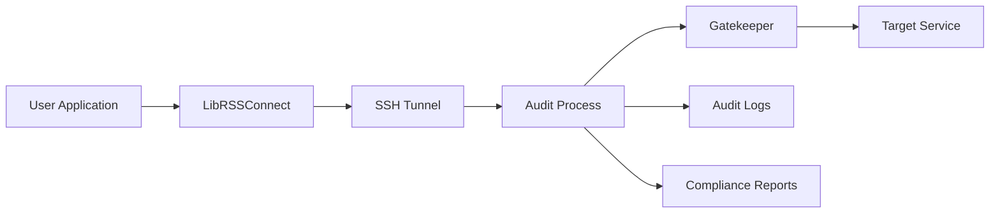

# PAS System Architecture Overview

## Executive Summary

The Privileged Access Security (PAS) system is a comprehensive privileged access management solution designed specifically for healthcare organizations requiring HIPAA compliance. The system provides secure, audited access to critical systems while maintaining strict data privacy and regulatory compliance requirements.

## System Purpose and Scope

### Primary Objectives
- **Secure Privileged Access**: Control and monitor all privileged access to critical systems
- **HIPAA Compliance**: Ensure all access patterns meet healthcare privacy requirements
- **Comprehensive Auditing**: Record and analyze all privileged sessions for compliance and security
- **Zero-Trust Architecture**: Authenticate, authorize, and audit every access attempt

### Target Environment
- **Healthcare Organizations**: Hospitals, clinics, and healthcare service providers
- **On-Premises Deployment**: Customer-controlled infrastructure with RPM-based deployment
- **Private Cloud**: Customer-managed cloud environments with strict data residency
- **Hybrid Environments**: Mixed on-premises and private cloud deployments

## High-Level Architecture

```mermaid
graph TB
    subgraph "Internet Zone"
        User[👤 End User]
        UCM[🖥️ UCM Client]
        LibRSS[📚 LibRSSConnect]
    end
    
    subgraph "Customer DMZ"
        Parent[🏠 PAS Server<br/>Web UI + Management]
        Audit[📊 Audit Process<br/>Session Recording]
        DB[(🗄️ Database<br/>PostgreSQL/MySQL)]
    end
    
    subgraph "Customer Internal Network"
        GK[🚪 Gatekeeper<br/>Service Proxy]
        Services[⚙️ Target Services<br/>SSH, RDP, HTTP]
    end
    
    User --> UCM
    UCM --> LibRSS
    LibRSS -.->|🔐 SSH + RSS| Parent
    LibRSS -.->|🔐 SSH Tunnels| Audit
    GK -.->|🔐 SSH + RSS| Parent
    Audit -->|📡 Proxied Traffic| GK
    GK --> Services
    Parent --> DB
    
    classDef internetZone fill:#E8F4FD,stroke:#1976D2
    classDef dmzZone fill:#FFF2CC,stroke:#F57C00
    classDef internalZone fill:#E1F5FE,stroke:#0288D1
    
    class User,UCM,LibRSS internetZone
    class Parent,Audit,DB dmzZone
    class GK,Services internalZone
```

## Core Components

### 1. PAS Server (Parent)
**Location**: Customer DMZ  
**Purpose**: Central management and web interface

**Key Responsibilities**:
- Web-based user interface for access requests
- User authentication and authorization
- Session management and coordination
- Configuration management
- Integration with customer identity systems

**Technology Stack**:
- Java Spring Boot application
- PostgreSQL or MySQL database
- HTTPS web interface
- RSS protocol server

### 2. Audit Process
**Location**: Customer DMZ (separate process from PAS Server)  
**Purpose**: Real-time session recording and analysis

**Key Responsibilities**:
- Protocol-specific traffic interception (SSH, RDP, HTTP, VNC)
- Real-time session recording and encryption
- Credential injection for seamless authentication
- Compliance reporting and audit trail generation

**Technology Stack**:
- Java-based audit services
- Protocol-specific proxy implementations
- Encrypted audit log storage
- IPC communication with PAS Server

### 3. Gatekeeper
**Location**: Customer internal network  
**Purpose**: Service proxy and access enforcement

**Key Responsibilities**:
- Proxy connections to target services
- Enforce access policies and time restrictions
- Coordinate with audit process for session recording
- Manage application-specific configurations

**Technology Stack**:
- Java Spring Boot application
- RSS protocol client
- Service-specific proxy implementations
- Local configuration management

### 4. UCM (Universal Connection Manager)
**Location**: End user devices  
**Purpose**: Client application for secure access

**Key Responsibilities**:
- User interface for access requests
- Client application launching (RDP, SSH clients)
- Local port forwarding and tunneling
- Integration with LibRSSConnect for protocol communication

**Technology Stack**:
- Qt-based desktop application
- Cross-platform support (Windows, macOS, Linux)
- Integration with system credential stores
- Local staging and temporary file management

### 5. LibRSSConnect
**Location**: End user devices (embedded in UCM)  
**Purpose**: RSS protocol client library

**Key Responsibilities**:
- RSS protocol implementation in C++
- SSH tunnel management and port forwarding
- Session state management
- Error handling and reconnection logic

**Technology Stack**:
- C++ library with C API interface
- SSH client implementation
- Cross-platform networking
- Protocol message parsing and generation

## Network Architecture

### Security Zones

#### Internet Zone
- **Components**: End user devices with UCM client
- **Security Level**: Untrusted network
- **Access Pattern**: Outbound HTTPS and SSH connections only
- **Data Protection**: All communication encrypted in transit

#### Customer DMZ
- **Components**: PAS Server, Audit Process, Database
- **Security Level**: Semi-trusted with controlled access
- **Access Pattern**: Inbound from Internet, outbound to Internal
- **Data Protection**: Encrypted storage, comprehensive audit logging

#### Customer Internal Network
- **Components**: Gatekeeper, Target Services
- **Security Level**: Trusted internal network
- **Access Pattern**: Inbound from DMZ, access to target services
- **Data Protection**: Network segmentation, access controls

### Communication Patterns

#### User Access Flow
1. **Authentication**: User authenticates via HTTPS to PAS Server
2. **Authorization**: PAS Server validates access permissions
3. **Session Request**: User requests access to specific service
4. **Tunnel Establishment**: SSH tunnels created between UCM and Audit
5. **Service Connection**: Gatekeeper proxies connection to target service
6. **Session Monitoring**: All traffic recorded and analyzed by Audit

#### Protocol Communication
- **RSS Protocol**: Custom protocol over SSH for component coordination
- **HTTPS**: Web interface and API communication
- **SSH**: Secure tunneling for all privileged access
- **Native Protocols**: SSH, RDP, HTTP preserved for target services

## Data Flow Architecture

### Session Establishment

### Traffic Flow

## Security Model

### Authentication
- **Multi-Factor Authentication**: Integration with customer identity systems
- **Certificate-Based**: SSH certificates for component authentication
- **Session Tokens**: Time-limited tokens for web interface access
- **Key Rotation**: Automated SSH key rotation for enhanced security

### Authorization
- **Role-Based Access Control**: Fine-grained permissions based on user roles
- **Time-Based Restrictions**: Access limited to approved time windows
- **Service-Specific Policies**: Different policies for different target services
- **Just-In-Time Access**: Temporary access elevation with approval workflows

### Audit and Compliance
- **Complete Session Recording**: All privileged sessions recorded in real-time
- **Encrypted Storage**: Audit logs encrypted at rest with customer-controlled keys
- **Compliance Reporting**: Automated reports for HIPAA and other regulations
- **Tamper Protection**: Cryptographic integrity protection for audit data

## Deployment Model

### RPM-Based Deployment
- **Package Management**: Standard RPM packages for Linux distributions
- **Configuration Management**: Hierarchical configuration with customer overrides
- **Service Management**: systemd integration for service lifecycle
- **Update Management**: In-place updates with configuration preservation

### Customer Control
- **On-Premises Installation**: Complete customer control over infrastructure
- **Data Residency**: All data remains within customer environment
- **Network Isolation**: No external dependencies for core functionality
- **Compliance Validation**: Customer-controlled compliance validation and reporting

### Scalability Considerations
- **Horizontal Scaling**: Multiple Gatekeeper instances for load distribution
- **Database Scaling**: Support for database clustering and replication
- **Audit Scaling**: Separate audit processes for high-volume environments
- **Geographic Distribution**: Multi-site deployment with centralized management

## Integration Points

### Customer Systems
- **Identity Providers**: LDAP, Active Directory, SAML, OAuth integration
- **SIEM Systems**: Audit log integration with customer security tools
- **Monitoring Systems**: Health and performance metrics integration
- **Backup Systems**: Integration with customer backup and recovery procedures

### External Services
- **Key Management**: Integration with existing key management infrastructure
- **Certificate Authorities**: Integration with customer PKI infrastructure
- **Time Services**: NTP integration for accurate audit timestamps
- **DNS Services**: Integration with customer DNS for service discovery

## Operational Characteristics

### Performance Requirements
- **Session Establishment**: Sub-second connection times
- **Concurrent Sessions**: Support for 1,000+ simultaneous sessions
- **Audit Processing**: Real-time recording with minimal latency impact
- **Database Performance**: Optimized for high-volume audit data storage

### Availability Requirements
- **High Availability**: 99.9% uptime target with redundancy options
- **Disaster Recovery**: Backup and recovery procedures for all components
- **Maintenance Windows**: Planned maintenance with minimal service impact
- **Monitoring and Alerting**: Comprehensive health monitoring and alerting

### Compliance Requirements
- **HIPAA Compliance**: Full compliance with healthcare privacy regulations
- **SOX Compliance**: Financial controls and audit trail requirements
- **PCI DSS**: Payment card industry security standards
- **Custom Regulations**: Flexible framework for additional compliance requirements

This architecture provides a comprehensive foundation for secure privileged access management in healthcare environments while maintaining the flexibility and control required for enterprise deployments.
