# PAS Deployment Model

## Executive Summary

The PAS system is designed for on-premises deployment in healthcare environments with strict data residency and compliance requirements. This document outlines the deployment architecture, packaging strategy, and operational considerations for RPM-based deployment.

## Deployment Architecture

### Target Environment Characteristics
- **Healthcare Organizations**: Hospitals, clinics, healthcare service providers
- **On-Premises Infrastructure**: Customer-controlled servers and networks
- **Private Cloud**: Customer-managed cloud environments
- **HIPAA Compliance**: Strict data privacy and security requirements
- **Network Isolation**: Limited or no internet connectivity for production systems

### Network Topology

```mermaid
graph TB
    subgraph "Internet"
        Users[👥 End Users<br/>Healthcare Staff]
        UCM[🖥️ UCM Clients<br/>Desktop Applications]
    end
    
    subgraph "Customer DMZ"
        LB[⚖️ Load Balancer<br/>HTTPS Termination]
        PAS1[🏠 PAS Server 1<br/>Primary Instance]
        PAS2[🏠 PAS Server 2<br/>Secondary Instance]
        Audit1[📊 Audit Process 1<br/>Session Recording]
        Audit2[📊 Audit Process 2<br/>Session Recording]
        DB[(🗄️ Database Cluster<br/>PostgreSQL HA)]
    end
    
    subgraph "Customer Internal Network"
        GK1[🚪 Gatekeeper 1<br/>Service Proxy]
        GK2[🚪 Gatekeeper 2<br/>Service Proxy]
        Services[⚙️ Target Services<br/>SSH, RDP, HTTP]
    end
    
    Users --> UCM
    UCM -.->|HTTPS/SSH| LB
    LB --> PAS1
    LB --> PAS2
    PAS1 -.->|IPC| Audit1
    PAS2 -.->|IPC| Audit2
    PAS1 --> DB
    PAS2 --> DB
    Audit1 -.->|SSH Tunnels| GK1
    Audit2 -.->|SSH Tunnels| GK2
    GK1 --> Services
    GK2 --> Services
    
    classDef internet fill:#E3F2FD,stroke:#1976D2
    classDef dmz fill:#FFF3E0,stroke:#F57C00
    classDef internal fill:#E8F5E8,stroke:#388E3C
    
    class Users,UCM internet
    class LB,PAS1,PAS2,Audit1,Audit2,DB dmz
    class GK1,GK2,Services internal
```


## RPM Package Strategy

### Package Organization
```
PAS System RPM Packages:
├── pas-server-{version}.rpm          # PAS Server + Web UI
├── pas-audit-{version}.rpm           # Audit Process
├── pas-gatekeeper-{version}.rpm      # Gatekeeper Service
├── pas-ucm-{version}.rpm             # UCM Client (Linux)
├── pas-monitoring-{version}.rpm      # Monitoring Stack
└── pas-database-{version}.rpm        # Database Setup Scripts
```

### Package Dependencies

```mermaid
graph TB
    subgraph "RPM Package Dependencies"
        Server[📦 pas-server<br/>Core Management]
        Audit[📦 pas-audit<br/>Session Recording]
        GK[📦 pas-gatekeeper<br/>Service Proxy]
        Monitor[📦 pas-monitoring<br/>Observability]
        DB[📦 pas-database<br/>Database Setup]
        UCM[📦 pas-ucm<br/>Client Application]
    end
    
    Server -.->|Requires| DB
    Audit -.->|Requires| Server
    GK -.->|Requires| Server
    Monitor -.->|Optional| Server
    UCM -.->|Connects to| Server
    
    classDef core fill:#E3F2FD,stroke:#1976D2
    classDef optional fill:#FFF3E0,stroke:#F57C00
    classDef client fill:#E8F5E8,stroke:#388E3C
    
    class Server,Audit,GK,DB core
    class Monitor optional
    class UCM client
```


### Package Contents

#### pas-server Package
```
/usr/lib/pas/
├── pas-server.jar                    # Main application JAR
├── lib/                              # Dependency libraries
└── scripts/                          # Utility scripts

/etc/pas/
├── pas.conf                          # Main configuration
├── conf.d/                           # Modular configuration
├── templates/                        # Configuration templates
└── ssl/                              # SSL certificates

/var/lib/pas/
├── logs/                             # Application logs
├── temp/                             # Temporary files
└── staging/                          # Staging area

/usr/bin/
├── pas-configure                     # Configuration utility
├── pas-status                        # Status checking
└── pas-backup                        # Backup utility

/etc/systemd/system/
└── pas-server.service                # systemd service file
```

#### pas-audit Package
```
/usr/lib/pas-audit/
├── pas-audit.jar                     # Audit application JAR
├── lib/                              # Audit-specific libraries
└── protocols/                        # Protocol handlers

/etc/pas-audit/
├── audit.conf                        # Audit configuration
└── protocols/                        # Protocol configurations

/var/lib/pas-audit/
├── logs/                             # Audit logs
├── recordings/                       # Session recordings
└── temp/                             # Temporary audit files

/etc/systemd/system/
└── pas-audit.service                 # systemd service file
```

## Installation and Configuration

### Installation Process
```bash
# 1. Database Setup (on database server)
sudo rpm -ivh pas-database-1.0.0.rpm
sudo pas-db-setup --create-database --admin-user pas_admin

# 2. PAS Server Installation (on management server)
sudo rpm -ivh pas-server-1.0.0.rpm
sudo pas-configure init production
sudo systemctl enable pas-server
sudo systemctl start pas-server

# 3. Audit Process Installation (same server or separate)
sudo rpm -ivh pas-audit-1.0.0.rpm
sudo systemctl enable pas-audit
sudo systemctl start pas-audit

# 4. Gatekeeper Installation (on internal network servers)
sudo rpm -ivh pas-gatekeeper-1.0.0.rpm
sudo pas-configure set gatekeeper.parent_host "pas.company.local"
sudo systemctl enable pas-gatekeeper
sudo systemctl start pas-gatekeeper

# 5. Monitoring Installation (optional)
sudo rpm -ivh pas-monitoring-1.0.0.rpm
sudo systemctl enable prometheus grafana alertmanager
sudo systemctl start prometheus grafana alertmanager
```

### Configuration Management
```yaml
# /etc/pas/pas.conf - Main configuration file
pas:
  environment: production
  site_id: "customer_site_001"
  
  server:
    host: "pas.company.local"
    ports:
      https: 8443
      ssh: 22
      rss: 7894
    database:
      url: "jdbc:postgresql://db.company.local:5432/pas"
      username: "${PAS_DB_USER}"
      password: "${PAS_DB_PASSWORD}"
  
  audit:
    enabled: true
    protocols: ["ssh", "rdp", "http"]
    retention_days: 90
    encryption_key: "${PAS_AUDIT_KEY}"
  
  gatekeeper:
    poll_interval_seconds: 60
    max_connections: 100
  
  monitoring:
    enabled: true
    telemetry_enabled: false  # Customer controlled
```

## High Availability Deployment

### Multi-Server Configuration

```mermaid
graph TB
    subgraph "Load Balancer Tier"
        LB1[⚖️ Load Balancer 1<br/>Primary]
        LB2[⚖️ Load Balancer 2<br/>Secondary]
    end
    
    subgraph "Application Tier"
        PAS1[🏠 PAS Server 1<br/>Active]
        PAS2[🏠 PAS Server 2<br/>Active]
        PAS3[🏠 PAS Server 3<br/>Standby]
    end
    
    subgraph "Audit Tier"
        A1[📊 Audit Process 1<br/>Active]
        A2[📊 Audit Process 2<br/>Active]
        A3[📊 Audit Process 3<br/>Standby]
    end
    
    subgraph "Database Tier"
        DB1[(🗄️ PostgreSQL Primary)]
        DB2[(🗄️ PostgreSQL Replica)]
        DB3[(🗄️ PostgreSQL Replica)]
    end
    
    LB1 --> PAS1
    LB1 --> PAS2
    LB2 --> PAS1
    LB2 --> PAS2
    PAS1 -.->|IPC| A1
    PAS2 -.->|IPC| A2
    PAS3 -.->|IPC| A3
    PAS1 --> DB1
    PAS2 --> DB1
    PAS3 --> DB1
    DB1 -.->|Replication| DB2
    DB1 -.->|Replication| DB3
```


### HA Configuration
```yaml
# High Availability Configuration
high_availability:
  load_balancer:
    type: "haproxy"  # or customer's preferred LB
    health_check: "/health"
    session_affinity: true
    
  application_servers:
    min_instances: 2
    max_instances: 5
    health_check_interval: 30
    
  database:
    type: "postgresql_cluster"
    replication: "streaming"
    failover: "automatic"
    backup_schedule: "daily"
    
  audit_processes:
    instances_per_server: 1
    failover_mode: "active_passive"
    session_persistence: true
```

## Security Hardening

### System Security Configuration
```bash
# Security hardening script
#!/bin/bash
# /usr/lib/pas/scripts/harden-system.sh

# Firewall configuration
firewall-cmd --permanent --add-port=8443/tcp  # HTTPS
firewall-cmd --permanent --add-port=7894/tcp  # RSS Protocol
firewall-cmd --permanent --add-port=22/tcp    # SSH
firewall-cmd --reload

# SELinux configuration
setsebool -P httpd_can_network_connect 1
semanage port -a -t http_port_t -p tcp 8443

# SSL/TLS configuration
openssl req -x509 -newkey rsa:4096 -keyout /etc/pas/ssl/pas-key.pem \
    -out /etc/pas/ssl/pas-cert.pem -days 365 -nodes \
    -subj "/CN=pas.company.local"

# File permissions
chmod 600 /etc/pas/ssl/pas-key.pem
chmod 644 /etc/pas/ssl/pas-cert.pem
chown -R pas:pas /var/lib/pas/
chmod 750 /var/lib/pas/
```

### Network Security

#### **SSH Connection Policy Constraints**
The PAS deployment model enforces strict SSH connection policies:

**Core Security Constraint**:
- **PAS Server CANNOT initiate SSH connections** to any other component
- **PAS Server ONLY receives inbound SSH connections** from authorized components
- **All outbound connections from PAS Server** must use non-SSH protocols (HTTPS, RSS, etc.)

**Deployment Implications**:
- Network architecture must accommodate inbound-only SSH to PAS Server
- Firewall rules must allow SSH connections TO PAS Server, not FROM PAS Server
- Component placement must ensure proper connection flow direction

```yaml
# Network security configuration with SSH constraints
network_security:
  ssh_policy:
    pas_server_outbound_ssh: false  # CRITICAL: Never allow outbound SSH
    inbound_ssh_allowed:
      - source: "UCM Clients"
        destination: "PAS Server"
        purpose: "User session tunnels"
      - source: "Gatekeeper"
        destination: "PAS Server"
        purpose: "RSS protocol communication"
    outbound_ssh_prohibited:
      - source: "PAS Server"
        destination: "Any component"
        reason: "Security policy violation"

  firewall_rules:
    inbound:
      - port: 8443
        protocol: tcp
        source: "customer_network"
        description: "HTTPS web interface"
      - port: 7894
        protocol: tcp
        source: "internal_network"
        description: "RSS protocol"
    
    outbound:
      - port: 5432
        protocol: tcp
        destination: "database_server"
        description: "PostgreSQL connection"
  
  ssl_configuration:
    min_tls_version: "1.2"
    cipher_suites: "ECDHE-RSA-AES256-GCM-SHA384:ECDHE-RSA-AES128-GCM-SHA256"
    certificate_validation: true
```

## Backup and Recovery

### Backup Strategy
```yaml
# Backup configuration
backup:
  database:
    frequency: "daily"
    retention: "30 days"
    method: "pg_dump with compression"
    location: "/backup/database/"
    
  configuration:
    frequency: "before_changes"
    retention: "90 days"
    method: "tar.gz archive"
    location: "/backup/config/"
    
  audit_logs:
    frequency: "daily"
    retention: "7 years"  # HIPAA requirement
    method: "encrypted archive"
    location: "/backup/audit/"
    
  application:
    frequency: "weekly"
    retention: "12 weeks"
    method: "full system backup"
    location: "/backup/system/"
```

### Recovery Procedures
```bash
# Database recovery
sudo -u postgres pg_restore -d pas /backup/database/pas_backup_YYYYMMDD.sql.gz

# Configuration recovery
sudo tar -xzf /backup/config/pas_config_YYYYMMDD.tar.gz -C /etc/pas/

# Service restart after recovery
sudo systemctl restart pas-server pas-audit

# Verify system health
sudo pas-status --full-check
```

## Monitoring and Maintenance

### System Monitoring
```yaml
# Monitoring configuration
monitoring:
  system_metrics:
    - cpu_usage
    - memory_usage
    - disk_usage
    - network_throughput
    
  application_metrics:
    - active_sessions
    - session_establishment_time
    - error_rates
    - audit_processing_lag
    
  health_checks:
    - database_connectivity
    - audit_process_health
    - gatekeeper_connectivity
    - ssl_certificate_expiry
```

### Maintenance Procedures
```bash
# Regular maintenance script
#!/bin/bash
# /usr/lib/pas/scripts/maintenance.sh

# Log rotation
logrotate /etc/logrotate.d/pas

# Database maintenance
sudo -u postgres vacuumdb --analyze pas

# Certificate renewal check
pas-ssl-check --renew-if-needed

# Configuration validation
pas-configure validate

# Health check
pas-status --full-check
```

## Update and Upgrade Procedures

### Update Process
```bash
# Update procedure
# 1. Backup current system
sudo pas-backup --full

# 2. Download and verify new packages
sudo rpm --checksig pas-server-1.1.0.rpm

# 3. Update packages
sudo rpm -Uvh pas-server-1.1.0.rpm pas-audit-1.1.0.rpm

# 4. Validate configuration
sudo pas-configure validate

# 5. Restart services
sudo systemctl restart pas-server pas-audit

# 6. Verify functionality
sudo pas-status --post-update-check
```

### Rollback Procedures
```bash
# Rollback procedure
# 1. Stop services
sudo systemctl stop pas-server pas-audit

# 2. Restore previous packages
sudo rpm -Uvh --oldpackage pas-server-1.0.0.rpm pas-audit-1.0.0.rpm

# 3. Restore configuration
sudo pas-configure restore --from-backup

# 4. Restart services
sudo systemctl start pas-server pas-audit

# 5. Verify rollback
sudo pas-status --full-check
```

This deployment model provides a comprehensive framework for deploying and maintaining the PAS system in healthcare environments while ensuring HIPAA compliance and operational excellence.
