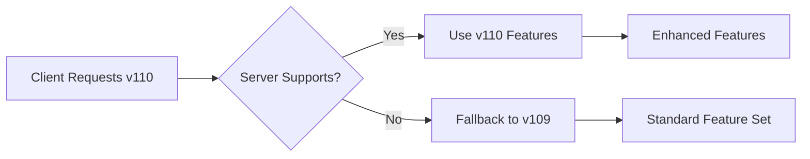
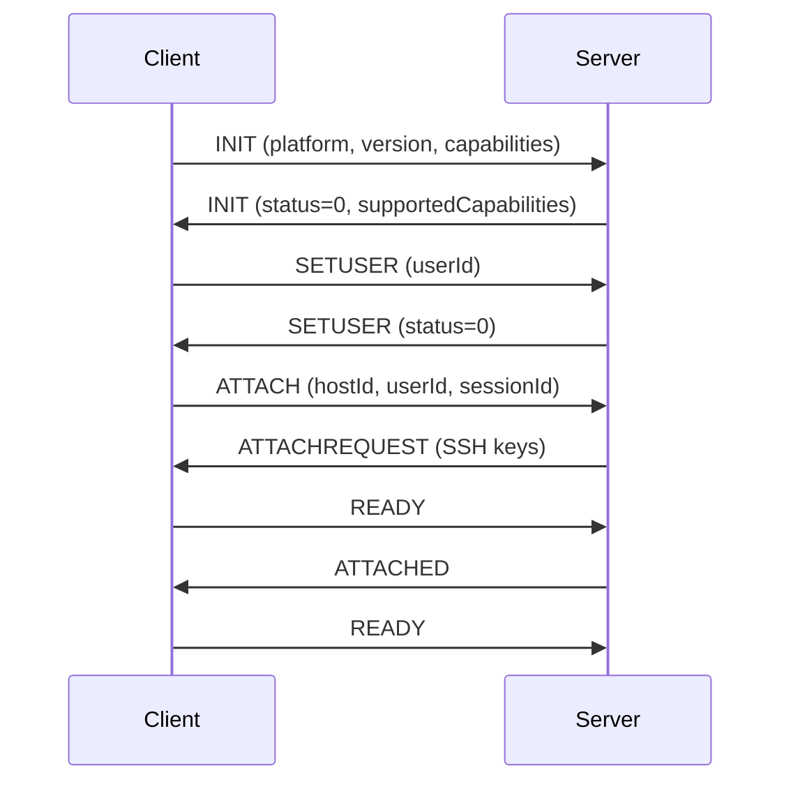
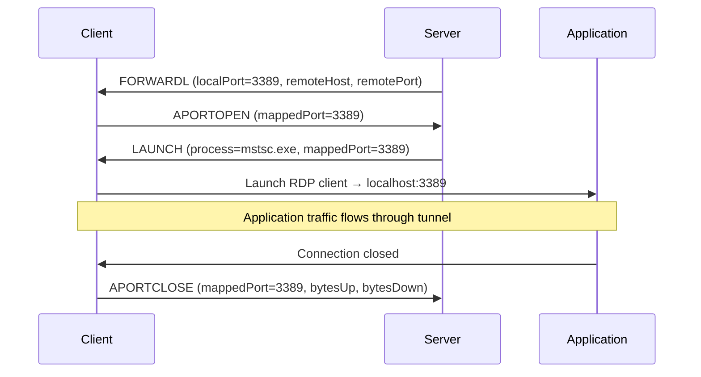

# RSS Protocol Specification

## Executive Summary

The RSS (Remote Secure Session) Protocol is a custom application-layer protocol designed for secure communication between PAS system components. It operates over SSH tunnels and uses a tab-delimited message format optimized for privileged access management operations.

## Protocol Overview

### Core Characteristics
- **Transport Layer**: TCP over SSH tunnels for security
- **Message Format**: Tab-delimited key-value pairs with UTF-8 encoding
- **Message Termination**: Newline (`\n`) character
- **Communication Pattern**: Bidirectional (both client and server initiate commands)
- **Version Support**: Backward-compatible versioning with capability negotiation
- **Security Model**: Assumes authenticated SSH transport layer

### Design Principles
- **Simplicity**: Human-readable text format for debugging and monitoring
- **Extensibility**: Key-value parameter structure allows protocol evolution
- **Security**: All communication over encrypted SSH tunnels
- **Reliability**: Sequential message processing with acknowledgments

## Message Structure

### Basic Format
```
COMMAND[\tkey1=value1\tkey2=value2\t...]\n
```

### Message Components
1. **Command**: String identifier for the operation (required)
2. **Parameters**: Tab-separated key-value pairs (optional)
3. **Terminator**: Single newline character (required)

### Encoding Rules
- **Character Encoding**: UTF-8
- **Parameter Separator**: Tab character (`\t`)
- **Key-Value Separator**: Equals sign (`=`)
- **Escape Sequences**: 
  - `\\t` for literal tab characters in values
  - `\\n` for literal newlines in values
  - `\\r` for literal carriage returns in values

### Example Messages
```
INIT	platform=Linux	platformVersion=5.4.0	userId=john.doe	requestedVersion=109
READY
FORWARDL	localHost=127.0.0.1	localPort=3389	remoteHost=10.1.1.100	remotePort=3389	protocol=TCP
LAUNCH	process=mstsc.exe	clientId=12345	mappedPort=3389	isURI=false	appId=rdp-app
APORTOPEN	mappedPort=3389	userId=john.doe
```

## Protocol Versioning

### Version Negotiation
- **Current Version**: 109 (production)
- **Development Version**: 110 (with enhanced features)
- **Minimum Supported**: 105
- **Negotiation**: Client requests version, server responds with supported version

### Version Compatibility


### Version-Specific Features
- **v105-108**: Basic RSS protocol functionality
- **v109**: Current production version with full feature set
- **v110**: Enhanced features (compression, batching, async errors)

## Command Categories

### 1. Session Management Commands

#### INIT - Initialize Connection
**Direction**: Client → Server  
**Purpose**: Establish connection and negotiate capabilities

**Required Parameters**:
- `platform` - Operating system (Linux, Windows, macOS)
- `platformVersion` - OS version string
- `requestedVersion` - Protocol version requested

**Optional Parameters**:
- `platformArchitecture` - CPU architecture (x86_64, arm64)
- `localHostName` - Client hostname
- `localIPAddress` - Client IP address
- `productName` - Client product identifier
- `capabilities` - Comma-separated capability list (v110+)

**Server Response**: INIT with `status=0` for success

#### SETUSER - Set User Context
**Direction**: Client → Server  
**Purpose**: Establish user context for session

**Parameters**:
- `userId` - User identifier for the session

**Server Response**: SETUSER with `status=0` for success

#### ATTACH - Attach to Host
**Direction**: Client → Server  
**Purpose**: Request attachment to specific host/gatekeeper

**Parameters**:
- `hostId` - Target host identifier
- `userId` - User identifier
- `sessionId` - Unique session identifier

**Server Response**: ATTACHREQUEST with SSH keys and session details

#### READY - Signal Readiness
**Direction**: Bidirectional  
**Purpose**: Signal component readiness for next phase

**Parameters**: None (command only)

### 2. Port Forwarding Commands

#### FORWARDL - Local Port Forward
**Direction**: Server → Client  
**Purpose**: Establish local port forwarding

**Parameters**:
- `localHost` - Local bind address (typically 127.0.0.1)
- `localPort` - Local port number
- `remoteHost` - Remote target address
- `remotePort` - Remote target port
- `protocol` - Protocol type (TCP/UDP)

#### FORWARDR - Remote Port Forward
**Direction**: Client → Server  
**Purpose**: Establish remote port forwarding

**Parameters**:
- `remoteHost` - Remote bind address
- `remotePort` - Remote port number
- `localHost` - Local target address
- `localPort` - Local target port
- `protocol` - Protocol type (TCP/UDP)

#### UNFORWARDL/UNFORWARDR - Remove Port Forwards
**Direction**: Bidirectional  
**Purpose**: Remove existing port forwards

**Parameters**:
- `localPort` or `remotePort` - Port to remove

### 3. Application Management Commands

#### LAUNCH - Launch Application
**Direction**: Server → Client  
**Purpose**: Instruct client to launch application

**Parameters**:
- `process` - Application executable name
- `clientId` - Unique client identifier
- `mappedPort` - Port for application connection
- `isURI` - Boolean indicating URI-based launch
- `appId` - Application identifier

#### AUDIT - Audit Configuration
**Direction**: Server → Client  
**Purpose**: Configure audit settings for session

**Parameters**:
- `auditHost` - Audit server address
- `auditPort` - Audit server port
- `protocol` - Protocol to audit (SSH, RDP, HTTP)

### 4. Monitoring and Status Commands

#### APORTOPEN - Port Opened Notification
**Direction**: Client → Server  
**Purpose**: Notify server that port is opened and ready

**Parameters**:
- `mappedPort` - Port number that was opened
- `userId` - User identifier

#### APORTCLOSE - Port Closed Notification
**Direction**: Client → Server  
**Purpose**: Notify server that port is closed with statistics

**Parameters**:
- `mappedPort` - Port number that was closed
- `bytesUp` - Bytes transmitted to server
- `bytesDown` - Bytes received from server
- `userId` - User identifier

#### APPLICATIONSTATUS - Application Status
**Direction**: Bidirectional  
**Purpose**: Report application status and health

**Parameters**:
- `status` - Status code (RUNNING, STOPPED, ERROR)
- `appId` - Application identifier
- `details` - Additional status information

### 5. Security and Key Management Commands

#### ROTATECONNECTKEY - Rotate Connection Key
**Direction**: Server → Client  
**Purpose**: Initiate SSH key rotation

**Parameters**:
- `keyType` - Type of key to rotate (RSA, EC)
- `keyId` - Identifier for key rotation

#### ATTACHREQUEST - Attachment Response
**Direction**: Server → Client  
**Purpose**: Provide SSH keys and session details

**Parameters**:
- `ckValue` - RSA private key (masked in logs)
- `ckValueEC` - EC private key (masked in logs)
- `sessionId` - Session identifier

### 6. Error and Failure Commands

#### FAILFWDL/FAILFWDR - Port Forward Failure
**Direction**: Client → Server  
**Purpose**: Report port forwarding failure

**Parameters**:
- `localPort` or `remotePort` - Failed port
- `error` - Error description
- `suggestedPort` - Alternative port suggestion

## Protocol Flows

### Session Establishment Flow


### Port Forwarding Flow


## Error Handling

### Status Codes
- `0` - Success
- `1` - General error
- `2` - Authentication failure
- `3` - Authorization failure
- `4` - Resource unavailable
- `5` - Version incompatibility

### Error Response Pattern
Commands that can fail include a `status` parameter in the response:
```
COMMAND_RESPONSE	status=0	[additional parameters]
COMMAND_RESPONSE	status=1	error=Description of error
```

### Failure Commands
Specific failure commands provide detailed error information:
- `FAILFWDL` - Local port forward failure
- `FAILFWDR` - Remote port forward failure
- Include error description and suggested alternatives

## Security Considerations

### Transport Security
- All RSS communication occurs over SSH tunnels
- SSH provides authentication, encryption, and integrity
- No additional encryption required at RSS protocol level

### Sensitive Data Handling
- SSH private keys (`ckValue`, `ckValueEC`) are masked in logs
- User credentials are not transmitted via RSS protocol
- Session identifiers are used for correlation, not authentication

### Protocol Security
- Protocol assumes authenticated SSH transport
- No authentication mechanism within RSS protocol itself
- Relies on SSH tunnel security for all protection

## Performance Characteristics

### Message Size Limits
- **Typical Message Size**: 100-500 bytes
- **Maximum Message Size**: 64KB (practical limit)
- **Large Data Handling**: Use separate channels for bulk data transfer

### Timing Requirements
- **Session Establishment**: < 2 seconds typical
- **Command Response**: < 100ms for most commands
- **Port Forward Setup**: < 500ms typical

### Throughput Considerations
- **Command Rate**: Up to 100 commands/second per session
- **Concurrent Sessions**: Limited by SSH tunnel capacity
- **Network Efficiency**: Text format optimized for readability over size

## Protocol Extensions (Version 110+)

### Enhanced Capabilities
- **Message Batching**: Combine multiple commands in single message
- **Compression**: GZIP compression for large messages
- **Async Errors**: Asynchronous error notifications with correlation IDs
- **Symmetric Port Monitoring**: Consistent APORTOPEN/APORTCLOSE behavior

### Capability Negotiation
```
INIT	capabilities=batched,compression,async_errors	requestedVersion=110
INIT	status=0	supportedCapabilities=compression,async_errors	maxVersion=110
```

### Backward Compatibility
- All v110 features are optional extensions
- Clients and servers gracefully degrade to v109 behavior
- Feature flags control extension activation

## Implementation Guidelines

### Message Processing
1. Parse command from message start to first tab or newline
2. Split remaining content on tab characters
3. Parse key-value pairs on equals sign
4. Handle escape sequences in values
5. Validate required parameters for command type

### Error Recovery
- Invalid messages should be logged and ignored
- Connection errors should trigger reconnection attempts
- Protocol version mismatches should fall back to compatible version

### Logging and Debugging
- Log all commands with sanitized parameters
- Mask sensitive data (SSH keys, credentials)
- Include timing information for performance analysis
- Use structured logging for automated analysis

---

*This specification reflects the current implementation in the PAS system codebase and includes planned enhancements for protocol optimization.*
