# PAS Security Model

## Executive Summary

The PAS security model implements a zero-trust architecture designed for healthcare environments with strict HIPAA compliance requirements. This document outlines the comprehensive security controls, authentication mechanisms, encryption standards, and access controls that protect privileged access and audit data.

## Security Architecture Principles

### Zero-Trust Architecture
- **Never Trust, Always Verify**: Every access request is authenticated and authorized
- **Least Privilege Access**: Users receive minimum necessary permissions
- **Continuous Monitoring**: All activities are monitored and audited in real-time
- **Assume Breach**: Security controls designed assuming network compromise

### Defense in Depth

```mermaid
graph TB
    subgraph "Security Layers"
        A[🌐 Network Security<br/>Firewalls, Segmentation]
        B[🔐 Transport Security<br/>TLS, SSH, mTLS]
        C[👤 Identity & Access<br/>Authentication, Authorization]
        D[📊 Application Security<br/>Input Validation, RBAC]
        E[💾 Data Security<br/>Encryption, Integrity]
        F[📋 Audit & Monitoring<br/>Logging, SIEM Integration]
    end
    
    A --> B --> C --> D --> E --> F
    
    classDef security fill:#F3E5F5,stroke:#7B1FA2
    class A,B,C,D,E,F security
```


## Authentication Architecture

### Multi-Factor Authentication (MFA)
```mermaid
graph TB
    subgraph "Authentication Factors"
        A[🔑 Something You Know<br/>Password, PIN]
        B[📱 Something You Have<br/>Token, Smart Card, Phone]
        C[👁️ Something You Are<br/>Biometrics (Future)]
    end
    
    subgraph "Authentication Flow"
        D[Primary Auth] --> E[MFA Challenge]
        E --> F[MFA Verification]
        F --> G[Session Token]
    end
    
    A --> D
    B --> E
    C --> E
    
    classDef factor fill:#E3F2FD,stroke:#1976D2
    classDef flow fill:#E8F5E8,stroke:#388E3C
    
    class A,B,C factor
    class D,E,F,G flow
```

### Identity Provider Integration
```yaml
# Supported identity providers
identity_providers:
  ldap:
    protocol: "LDAP v3"
    encryption: "LDAPS (TLS)"
    attributes: ["uid", "cn", "memberOf", "mail"]
    group_mapping: "LDAP groups to PAS roles"
    
  active_directory:
    protocol: "LDAP over TLS"
    authentication: "Kerberos or NTLM"
    group_sync: "Automatic role assignment"
    nested_groups: "Supported"
    
  saml:
    version: "SAML 2.0"
    binding: "HTTP POST"
    encryption: "XML encryption required"
    attributes: "Custom attribute mapping"
    
  oauth2_oidc:
    flows: ["Authorization Code", "Client Credentials"]
    scopes: ["openid", "profile", "groups"]
    token_validation: "JWT signature verification"
```

### Session Management
```yaml
# Session security configuration
session_management:
  token_format: "JWT with RS256 signature"
  expiration: "8 hours maximum"
  inactivity_timeout: "15 minutes"
  concurrent_sessions: "Limited per user"
  
  security_controls:
    secure_cookies: true
    httponly_cookies: true
    samesite_policy: "Strict"
    csrf_protection: true
    
  session_storage:
    location: "Server-side only"
    encryption: "AES-256-GCM"
    integrity: "HMAC-SHA256"
```

## Authorization and Access Control

### Role-Based Access Control (RBAC)

```mermaid
graph TB
    subgraph "RBAC Hierarchy"
        A[👑 System Administrator<br/>Full system access]
        B[🔧 Security Administrator<br/>Security configuration]
        C[📊 Audit Administrator<br/>Audit management]
        D[👥 User Administrator<br/>User management]
        E[🎯 Service Administrator<br/>Service configuration]
        F[👤 End User<br/>Service access only]
    end
    
    A --> B
    A --> C
    A --> D
    A --> E
    B --> F
    C --> F
    D --> F
    E --> F
    
    classDef admin fill:#FFCDD2,stroke:#D32F2F
    classDef operator fill:#FFF3E0,stroke:#F57C00
    classDef user fill:#E8F5E8,stroke:#388E3C
    
    class A,B,C admin
    class D,E operator
    class F user
```


### Permission Matrix
```yaml
# Detailed permission matrix
permissions:
  system_administration:
    - manage_system_configuration
    - manage_ssl_certificates
    - manage_database_connections
    - view_system_logs
    - manage_backup_restore
    
  security_administration:
    - manage_user_roles
    - configure_authentication
    - manage_encryption_keys
    - configure_audit_policies
    - view_security_events
    
  audit_administration:
    - configure_audit_settings
    - view_audit_logs
    - generate_compliance_reports
    - manage_audit_retention
    - export_audit_data
    
  user_administration:
    - create_modify_users
    - assign_user_roles
    - manage_user_sessions
    - view_user_activity
    - reset_user_passwords
    
  service_administration:
    - configure_target_services
    - manage_gatekeeper_settings
    - configure_protocol_settings
    - view_service_health
    - manage_service_connections
    
  end_user:
    - request_service_access
    - view_own_sessions
    - launch_applications
    - view_own_audit_logs
```

### Attribute-Based Access Control (ABAC)
```yaml
# Advanced access control policies
abac_policies:
  time_based_access:
    business_hours: "Monday-Friday 8AM-6PM"
    emergency_access: "24/7 for emergency roles"
    maintenance_windows: "Restricted during maintenance"
    
  location_based_access:
    ip_restrictions: "Corporate network only"
    geographic_restrictions: "Country-based restrictions"
    network_zones: "DMZ, Internal, Management"
    
  context_based_access:
    device_trust: "Managed devices preferred"
    risk_assessment: "Adaptive authentication"
    session_context: "Previous session behavior"
    
  data_classification:
    phi_access: "Healthcare staff only"
    financial_data: "Finance team only"
    administrative_data: "IT staff only"
```

## Encryption and Cryptography

### Encryption Standards
```yaml
# Cryptographic standards and algorithms
encryption_standards:
  symmetric_encryption:
    algorithm: "AES-256-GCM"
    key_size: "256 bits"
    mode: "Galois/Counter Mode"
    use_cases: ["Data at rest", "Session tokens"]
    
  asymmetric_encryption:
    algorithm: "RSA-4096 or ECDSA P-384"
    key_size: "4096 bits (RSA) or 384 bits (ECDSA)"
    use_cases: ["Key exchange", "Digital signatures"]
    
  hashing:
    algorithm: "SHA-256 or SHA-3"
    salt: "Cryptographically random salt"
    iterations: "100,000+ PBKDF2 iterations"
    use_cases: ["Password hashing", "Integrity verification"]
    
  transport_encryption:
    tls_version: "TLS 1.2 minimum, TLS 1.3 preferred"
    cipher_suites: "ECDHE-RSA-AES256-GCM-SHA384"
    certificate_validation: "Full chain validation"
```

### Key Management

```mermaid
graph TB
    subgraph "Key Management Hierarchy"
        A[🔐 Master Key<br/>HSM Protected]
        B[🔑 Data Encryption Keys<br/>Database, Files]
        C[🗝️ Session Keys<br/>Temporary, Rotating]
        D[📜 Signing Keys<br/>Digital Signatures]
    end
    
    subgraph "Key Lifecycle"
        E[Generation] --> F[Distribution]
        F --> G[Usage]
        G --> H[Rotation]
        H --> I[Revocation]
        I --> J[Destruction]
    end
    
    A --> B
    A --> C
    A --> D
    
    classDef keys fill:#F3E5F5,stroke:#7B1FA2
    classDef lifecycle fill:#E3F2FD,stroke:#1976D2
    
    class A,B,C,D keys
    class E,F,G,H,I,J lifecycle
```


### Key Management Integration
```yaml
# Key management service integration
key_management:
  external_kms:
    provider: "Customer HSM or KMS"
    integration: "PKCS#11 or REST API"
    key_types: ["AES", "RSA", "ECDSA"]
    
  key_rotation:
    frequency: "Annual minimum"
    automated: "Preferred where possible"
    emergency_rotation: "On-demand capability"
    
  key_escrow:
    enabled: "Customer controlled"
    access_controls: "Multi-person authorization"
    audit_trail: "Complete key access logging"
```

## Network Security

### SSH Connection Policy Constraints

#### **Critical Security Constraint: PAS Server SSH Connection Policy**
The PAS Server (Parent) operates under a strict security policy regarding SSH connections:

- ✅ **PAS Server MAY receive SSH connections** from other components
- ❌ **PAS Server MAY NOT initiate SSH connections** to any other component
- ✅ **Other components initiate SSH connections TO PAS Server**

This constraint ensures:
- **Clear security boundaries** - PAS Server never reaches out to potentially compromised zones
- **Audit compliance** - All SSH connections are inbound to the controlled DMZ environment
- **Network security** - Prevents PAS Server from being used as a pivot point for attacks
- **Operational security** - Reduces attack surface by limiting outbound connections

#### **SSH Connection Patterns**
```yaml
# Allowed SSH connection patterns
ssh_connections:
  allowed:
    - source: "UCM Clients (Internet Zone)"
      destination: "PAS Server/Audit (DMZ)"
      purpose: "User session tunnels"

    - source: "Gatekeeper (Internal Zone)"
      destination: "PAS Server (DMZ)"
      purpose: "RSS protocol communication"

    - source: "Other PAS Components"
      destination: "PAS Server (DMZ)"
      purpose: "System coordination"

  prohibited:
    - source: "PAS Server (DMZ)"
      destination: "Any external component"
      reason: "Security policy violation"
```

### Network Segmentation

```mermaid
graph TB
    subgraph "Network Security Zones"
        A[🌐 Internet Zone<br/>Untrusted]
        B[🛡️ DMZ Zone<br/>Semi-trusted]
        C[🏢 Internal Zone<br/>Trusted]
        D[🔒 Management Zone<br/>Highly Trusted]
    end
    
    subgraph "Security Controls"
        E[🔥 Firewall Rules]
        F[🔍 IDS/IPS]
        G[📊 Network Monitoring]
        H[🚫 Access Control Lists]
    end
    
    A -.->|Controlled| B
    B -.->|Controlled| C
    C -.->|Controlled| D
    
    E --> A
    E --> B
    E --> C
    F --> B
    F --> C
    G --> A
    G --> B
    G --> C
    H --> D
    
    classDef zone fill:#E3F2FD,stroke:#1976D2
    classDef control fill:#F3E5F5,stroke:#7B1FA2
    
    class A,B,C,D zone
    class E,F,G,H control
```


### Firewall Configuration
```yaml
# Network firewall rules
firewall_rules:
  inbound_rules:
    web_interface:
      port: 8443
      protocol: "HTTPS"
      source: "Corporate network"
      destination: "PAS Server"
      
    ssh_tunnels:
      port: 22
      protocol: "SSH"
      source: "UCM clients"
      destination: "Audit Process"
      
    rss_protocol:
      port: 7894
      protocol: "TCP"
      source: "Gatekeeper"
      destination: "PAS Server"
      
  outbound_rules:
    database:
      port: 5432
      protocol: "PostgreSQL"
      source: "PAS Server"
      destination: "Database Server"
      
    ldap:
      port: 636
      protocol: "LDAPS"
      source: "PAS Server"
      destination: "LDAP Server"
      
  default_policy: "DENY ALL"
```

## Application Security

### Input Validation and Sanitization
```yaml
# Input validation controls
input_validation:
  web_interface:
    csrf_protection: true
    xss_prevention: "Content Security Policy"
    sql_injection: "Parameterized queries only"
    file_upload: "Restricted file types and scanning"
    
  api_endpoints:
    input_validation: "JSON schema validation"
    rate_limiting: "Per-user and per-IP limits"
    authentication: "Required for all endpoints"
    authorization: "Role-based endpoint access"
    
  rss_protocol:
    message_validation: "Protocol schema validation"
    parameter_sanitization: "Escape special characters"
    command_whitelist: "Allowed commands only"
    size_limits: "Maximum message size limits"
```

### Secure Development Practices
```yaml
# Security development lifecycle
secure_development:
  code_review:
    security_focused: "Security-specific code reviews"
    automated_scanning: "SAST and DAST tools"
    dependency_scanning: "Third-party vulnerability scanning"
    
  testing:
    security_testing: "Penetration testing"
    vulnerability_assessment: "Regular security assessments"
    compliance_testing: "HIPAA compliance validation"
    
  deployment:
    secure_configuration: "Security hardening guides"
    secrets_management: "No hardcoded secrets"
    container_security: "Container image scanning"
```

## Audit and Monitoring Security

### Security Event Monitoring


### Security Metrics and KPIs
```yaml
# Security monitoring metrics
security_metrics:
  authentication:
    failed_login_attempts: "Per user, per hour"
    successful_logins: "By user, time, location"
    mfa_usage_rate: "Percentage of MFA-enabled logins"
    
  authorization:
    privilege_escalation_attempts: "Unauthorized access attempts"
    role_changes: "User role modifications"
    permission_violations: "Access denied events"
    
  system_security:
    vulnerability_scan_results: "Critical/High vulnerabilities"
    patch_compliance: "Percentage of systems patched"
    certificate_expiration: "SSL/TLS certificate status"
    
  incident_response:
    mean_time_to_detection: "Security incident detection time"
    mean_time_to_response: "Incident response time"
    false_positive_rate: "Alert accuracy metrics"
```

## Compliance and Regulatory Security

### HIPAA Security Controls
```yaml
# HIPAA-specific security implementations
hipaa_security:
  administrative_safeguards:
    security_officer: "Designated HIPAA security officer"
    workforce_training: "Regular HIPAA security training"
    access_management: "Formal access authorization process"
    
  physical_safeguards:
    facility_access: "Physical access controls"
    workstation_security: "Secure workstation configuration"
    media_controls: "Secure media handling procedures"
    
  technical_safeguards:
    access_control: "Unique user identification and authentication"
    audit_controls: "Comprehensive audit logging"
    integrity: "Data integrity protection"
    transmission_security: "End-to-end encryption"
```

### Compliance Reporting
```yaml
# Automated compliance reporting
compliance_reporting:
  hipaa_reports:
    access_reports: "Who accessed what, when"
    audit_reports: "System access and modifications"
    breach_reports: "Potential security incidents"
    
  sox_reports:
    financial_controls: "Financial system access controls"
    change_management: "System change documentation"
    segregation_duties: "Role separation compliance"
    
  pci_reports:
    cardholder_data: "Payment data access controls"
    network_security: "Network segmentation compliance"
    vulnerability_management: "Security vulnerability status"
```

This security model provides comprehensive protection for the PAS system while maintaining the flexibility and usability required for healthcare environments, ensuring both security and compliance with regulatory requirements.
